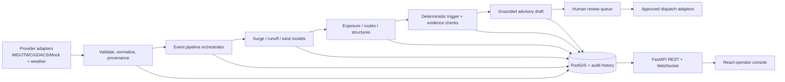

# Climate_Predection — UAV Digital Twin Reference-Aligned Implementation Plan

**Purpose:** Make the cyclone anticipatory-action platform feel and operate like the `UAV_Digital_Twin` reference—an information-dense, real-time, explainable operator console backed by clear modular services—while preserving cyclone response as the product domain.

**Repos reviewed:**
- Target: [Lolimancer-07/Climate_Predection](https://github.com/Lolimancer-07/Climate_Predection), checkout `02ceae9`
- Reference: [Lolimancer-07/UAV_Digital_Twin](https://github.com/Lolimancer-07/UAV_Digital_Twin), checkout `0185601`
- Review basis: repository source trees and documentation available on **2026-09-28**.

> **Recommendation:** Reuse the reference’s *product patterns*—operational dashboard, modular reasoning pipeline, observable state, scenario simulation, explainability, and human-controlled actions. Do not port UAV telemetry, propulsion physics, flight-control commands, or aircraft claims into the cyclone product.

---

## 1. Target outcome

Deliver a **Cyclone Operations Digital Twin** for district and disaster-management operators:

1. Ingest and identify an active or replayed storm, with a visible source and freshness state.
2. Project track, intensity, and uncertainty; identify threatened districts and wards.
3. Run surge, rainfall/runoff, wind/exposure, structural fragility, and route-impact models.
4. Compare independent evidence and explain *why* a warning or asset score was produced.
5. Simulate alternative storm tracks, intensities, or lead times without changing the underlying event.
6. Present a ranked, auditable action queue: advisories, shelters/routes/assets, hardening, and policy triggers.
7. Keep dispatch and any insurance-related external action behind explicit authorized human review.

The result should *look* like an operational GCS, but remain a disaster-response dashboard—not an aerospace dashboard.

---

## 2. Verified current-state audit

The target repository is already materially developed; this is primarily a **consolidation, integration, and finish-the-live-path** plan, not a greenfield rewrite.

| Area | Present in target checkout | Important gap to address |
|---|---|---|
| Product domain | Cyclone anticipatory action for Bay of Bengal/APAC; Fani/Puri replay and a mock active storm | Make demo/live/historical modes explicit and clearly identify mock versus authoritative inputs |
| Hazard and impact models | Parametric surge, runoff, exposure/criticality, route impact, structural engineering, insurance trigger, track forecast | Connect all modules through one validated event/district pipeline and version each output |
| Ingestion | Provider interfaces, mock/IMD/JTWC/GDACS provider files, GEE helpers, weather schemas and sample storm/rainfall data | Prove adapter contract behavior, source timestamps, freshness, fallback behavior, and input validation |
| API/backend | FastAPI, routers, SQLAlchemy/GeoAlchemy2 entities, PostGIS schema, model/provider registries, feature flags | Some live-storm endpoints are still stubs; pipeline jobs and WebSocket client state are in-memory; several routes need genuine DB reads/writes and authorization enforcement |
| Frontend | React 18, Vite, TypeScript, MapLibre, TanStack Query, Recharts; live tracker, historical replay, admin, insurer, hardening, damage, and trends pages | Bring pages under one consistent GCS shell, make the active event/district context global, and wire views to persisted API data instead of placeholder/demo responses |
| Dispatch and AI | Advisory prompts/client/validator and CAP, PDF, SMS/WhatsApp, insurer webhook modules | Persist a review queue and dispatch history; enforce numeric grounding and human approval at the actual API boundary |
| Verification | Unit and integration tests exist for hazard, exposure, structural, trigger and end-to-end behavior | Add provider contracts, API/DB/WebSocket and frontend tests; no baseline test run could be completed because `pytest` is not installed in the review environment |

### Immediate codebase issues verified in the current checkout

1. **Package-path mismatch:** source directories are named `data-ingestion/` and `ai-reasoning/`, while Python imports in the pipeline and tests use `data_ingestion` and `ai_reasoning`. Hyphens are not valid Python import-package names. Normalize package paths (preferred: rename to `data_ingestion/` and `ai_reasoning/`, then update references) and add an import smoke test before feature work.
2. **In-memory pipeline state:** `backend/routers/pipeline.py` stores jobs and WebSocket subscribers in process globals and uses FastAPI `BackgroundTasks`. This is acceptable for a short local demo only; it loses jobs on restart and is not safe across multiple workers.
3. **Live-storm placeholders:** `backend/routers/storms.py` currently returns a static Puri threat result, a mock job ID and fixed timeline; the cone endpoint returns WKT rather than a standard GeoJSON feature collection. Replace these with database-backed spatial queries, the shared orchestrator, and one stable API schema.
4. **Persisted entities are not sufficient by themselves:** ORM models exist, but the live path must actually persist event/storm versions, pipeline runs/stages, model outputs, review decisions, trigger records, and dispatch outcomes.
5. **Authorization must be server-side:** a frontend role switcher or hidden menu is not access control. Enforce roles and event-scoped permissions on protected API operations.
6. **Claims and licensing:** the UAV reference describes itself with proprietary/defense language and DO-178C-style badges. Treat it as a behavior/design reference; do not copy its source or assets without permission or repeat its certification claims. The target README advertises MIT, but verify the actual license file before redistributing the target or derivative code.

---

## 3. What to take from the reference—and what not to

| Reference pattern | Cyclone equivalent | Treatment |
|---|---|---|
| 10-tab Ground Control Station | Focused operator navigation for storm overview, map, timeline, assets, model evidence, advisories, insurance, trends, admin | Adopt the information architecture; do not create ten tabs just to match a count |
| Live telemetry provider + socket | Storm/event state provider + WebSocket risk updates | Adopt typed client state and reconnect/error states; send hazard-stage updates, not 10 Hz UAV telemetry |
| AI + physics twin consistency cases | Independent hazard/model/data checks (e.g. track source agreement, physical plausibility, sensor/data quality, model disagreement) | Adapt as evidence comparison; do not copy the aviation Case A–D rules as-is |
| Fault injection | Reproducible **storm scenario controls**: track offset, intensity delta, rainfall multiplier, lead time, model version | Adapt as simulation-only; never describe a scenario perturbation as an observed forecast |
| RUL/prognostics with uncertainty | Forecast lead-time risk timeline and track-cone uncertainty; model confidence/freshness and calibrated error summaries | Adopt explicit uncertainty and provenance; do not invent cyclone RUL scores |
| XAI root cause | Ranked risk drivers: surge, rainfall, wind, terrain, exposure, route blockage, or data-quality issue | Use evidence-linked explanations grounded in structured model outputs |
| Mission-risk recommendation | Ward/district response options with expected impact, constraints, and evidence | Keep recommendations as decision support; authorized officials make operational decisions |
| Fleet view | Multi-storm and multi-district overview, with event status and attention queue | Adapt only if useful; no false claim of a fleet of aircraft |
| Scripted 9-step demo | Scripted Fani replay and separate mock-live scenario walkthrough | Adopt repeatability and timeline; label historic, synthetic, and live data truthfully |

---

## 4. Target UX: reference-like operator console

### 4.1 Shell and visual language

Create a persistent **dark operations shell** inspired by the reference’s high-contrast GCS:

- **Left collapsible navigation:** brand/event context at top; operational groups below; active view marked clearly.
- **Top status strip:** selected storm, provider (`MOCK`, `IMD`, `JTWC`, etc.), last update age, pipeline state, basin, selected district, and connection health.
- **Main workspace:** map-first overview with compact KPI ribbon and one or more evidence panels. Keep a clear visual hierarchy rather than a wall of cards.
- **Right action rail:** highest-risk wards/assets, advisory review state, next operator action, and audit/provenance shortcuts.
- **Consistent interaction primitives:** badges for Watch/Warning/Evacuation, small monospace numeric readouts, compact charts/sparklines, contextual drawers, keyboard-accessible dialogs, and responsive collapse behavior.
- **Theme tokens:** retain the existing dark CSS foundation and severity palette; consolidate the target's `index.css` and `theme/tokens.css` so there is one source of truth. Use cyan/blue for information, green for normal, amber/orange for watch/warning, red for evacuation/critical, and purple only for financial-trigger state.
- Motion and sound are optional enhancements; default to reduced-motion support and no audio alerts unless an operator enables them.

Keep the existing Vite/React 18/TypeScript/MapLibre/TanStack Query stack. **Do not migrate to the reference’s Next.js/React 19 stack merely for visual similarity.**

### 4.2 Navigation and page mapping

Recommended navigation, grouped by operational task:

1. **Operations Overview** — KPIs, active storm(s), highest-risk districts, model/provider health, approvals waiting.
2. **Live Storm Tracker** — observed/forecast track, uncertainty cone, affected-district selection, data-source/freshness badges.
3. **Impact Map** — toggle surge, rainfall, wind, exposure, structural damage, shelters, and blocked routes; asset/ward detail drawer.
4. **Risk Timeline** — lead-time scrubber and comparable risk curves, including model/version/source labels.
5. **Model Evidence** — model outputs, confidence, validation checks, agreement/disagreement, and ranked risk drivers.
6. **Scenario Lab** — simulation-only adjustments and side-by-side baseline versus scenario results.
7. **Advisories & Review** — generated draft, numeric citations, edit/diff, approver identity, approval/rejection history.
8. **Insurance Triggers** — deterministic trigger results, policy threshold evidence, signed audit artifact and notification state; no payment execution.
9. **Assets & Hardening** — ranked assets, fragility assumptions/confidence, shelter capacity, evacuation routes, and suggested mitigations.
10. **After-Action / Damage Assessment** — historical trends and pre/post imagery validation, with unverified visual findings labeled as such.
11. **Administration** — role-based access, district/basin setup, provider/model configuration, and audit export.

The existing pages (`LiveStormTracker`, `Dashboard`, `HardeningPriorityPage`, `DamageAssessmentPage`, `HistoricalTrendsPage`, `InsurerDashboard`, `AdminPanel`) are a starting point. Prioritize a consistent shell and reliable shared event context before adding new page count.

### 4.3 First-screen composition

For the default operations screen, use a three-part layout:

- **Top row:** active-event/provider badge, storm category/intensity, ETA/lead time, number of threatened wards, pipeline freshness, and “last recomputed”.
- **Center:** MapLibre map with observed track, forecast track/cone, surge/rainfall layers and clickable at-risk assets/wards.
- **Side/bottom panels:** risk drivers, exposure/evacuation summary, risk timeline, and prioritized advisory/review queue.

Every visible data value should have a unit, time, source, and a drill-down path. If a value is synthetic, cached, stale, unavailable, or model-derived, say so in the UI.

---

## 5. Backend target: modular cyclone reasoning core

### 5.1 Architecture

### 5.2 Backend design rules

- Preserve FastAPI and the existing domain-model modules; routers should validate, authorize, call application services, and serialize—not contain model calculations.
- Normalize the Python package layout first. Keep domain packages importable and test their public interfaces.
- Define Pydantic v2 schemas for normalized storm fixes, forecasts, rainfall grids, hazard outputs, impact scores, trigger evidence, advisory drafts, jobs, and WebSocket messages. Version response contracts and use GeoJSON for spatial API payloads.
- Keep ingestion behind provider interfaces and resolve the active implementation through `provider_registry.py`. Add a provider contract suite so a real or mock provider returns identical normalized shapes.
- Keep the existing model registry and extend it so every result includes model name/version, configuration/calibration ID, inputs, units, generated-at time, and uncertainty/limitations where available.
- Build one idempotent application-service pipeline: **validate → ingest/update → forecast → surge/runoff/wind → merge hazards → exposure/route/structural scoring → deterministic trigger → grounded advisory draft → review queue**.
- Persist each run and stage transition. Store source snapshots or immutable input references so a past output can be reproduced. Add event/district indexes and PostGIS spatial indexes before scaling spatial queries.
- Use a durable, bounded worker mechanism for production-like runs. For the first usable increment, implement a persisted job table plus one worker; adopt Redis/Celery/RQ only if deployment and concurrency needs justify the extra service. Do not rely on process-local dictionaries as the source of truth.
- Publish WebSocket events from the job lifecycle (`queued`, `stage_started`, `stage_completed`, `completed`, `failed`, `review_required`) with event ID, run ID, sequence/time, and compact payload. WebSockets should reflect persisted state and clients should be able to recover by fetching the REST run snapshot after reconnect.
- Keep deterministic insurance evaluation independent of Gemini. Gemini may draft a human-readable explanation only. Validate every output number/name against the structured payload before a draft enters review.
- Make action boundaries explicit: **simulation actions are safe and reversible; dispatch and insurer notifications require authenticated role checks and an explicit review/approval record.** Never execute payouts or represent a trigger record as a funds transfer.
- Apply RBAC on the API: public/read-only, DDMA operator, insurer viewer, and admin. Limit insurer responses to their approved trigger/audit fields and exclude citizen contact data.
- Add structured logs with `event_id`, `run_id`, stage, provider, model version, and latency; avoid logging secrets or personal contact data.

### 5.3 API surface to complete

Keep existing routes during transition, but establish canonical `/v1` contracts. Suggested minimum:

| Method | Endpoint | Purpose |
|---|---|---|
| `GET` | `/v1/storms/active` | Active events plus provider/freshness and mode |
| `GET` | `/v1/storms/{storm_id}/track` | Observed and forecast fixes with metadata |
| `GET` | `/v1/storms/{storm_id}/cone` | GeoJSON feature collection and uncertainty metadata |
| `GET` | `/v1/storms/{storm_id}/threatened-districts` | Spatially resolved districts/earliest impact |
| `POST` | `/v1/storms/{storm_id}/runs` | Queue a full or selected-district pipeline run; returns durable `run_id` |
| `GET` | `/v1/runs/{run_id}` | Status, stage history, errors, model/source versions, output links |
| `GET` | `/v1/storms/{storm_id}/risk-timeline` | Persisted lead-time snapshots and uncertainty |
| `POST` | `/v1/scenarios` | Create a simulation-only scenario from a baseline run |
| `GET` | `/v1/scenarios/{scenario_id}` | Baseline/scenario comparison |
| `GET` | `/v1/runs/{run_id}/advisories` | Draft and numeric evidence |
| `POST` | `/v1/advisories/{id}/review` | Authorized approve/reject/edit decision with audit record |
| `POST` | `/v1/advisories/{id}/dispatch` | Authorized dispatch after review; records per-channel outcome |
| `GET` | `/v1/insurance/triggers?storm_id=...` | Deterministic trigger state and audit evidence, read/role-scoped |
| `WS` | `/ws/storms/{storm_id}` | Push pipeline changes/risk updates; recover via REST on reconnect |

Avoid returning WKT in place of GeoJSON for map-consumed endpoints. Define stable error codes and pagination/filters for asset and event lists.

### 5.4 Data and persistence

Use the target's existing PostGIS concepts as the canonical store and fill the gaps exposed by implementation:

- Storm/event identity, provider/source, observed fixes, forecast fixes, cone geometry, update times, and active/replay/synthetic mode.
- District and ward boundaries, population aggregates, and asset layers (roads, shelters, hospitals, power infrastructure) with source and effective date.
- Pipeline run, stage records, idempotency key, status, failure details, configuration snapshot, and model/provider versions.
- Hazard polygons/grids, impact scores, structural assessments, evacuation route/shelter-capacity output, and links to source run.
- Insurance policy trigger observations and signed audit record; advisory draft/version/review decision; dispatch attempt/result by channel.
- Provenance for every generated output: source timestamp, provider, model/version, unit, confidence or known limitation, and data-quality checks.

Use database migrations—not only `create_all`/startup behavior—for schema evolution. Seed demo fixtures separately from production ingestion.

---

## 6. Frontend implementation map

| Target area | Work |
|---|---|
| `frontend/src/App.tsx` | Turn current top-only navigation into a reference-inspired collapsible operator shell; preserve role-aware page access and add persistent storm/district context |
| `frontend/src/index.css`, `frontend/src/theme/tokens.css` | Consolidate duplicate tokens, define reusable surface/severity/spacing/typography states, responsive layouts, focus states, and reduced-motion behavior |
| `frontend/src/pages/LiveStormTracker.tsx` | Default operational view: storm selector, freshness/mode, map, threatened districts, risk summary and run controls |
| `frontend/src/components/MapView.tsx`, `StormTrackMap.tsx` | Layer control, observed/forecast distinction, uncertainty cone, ward/asset selection, map legend, accessible loading/no-data states |
| `frontend/src/components/RiskPanel.tsx`, `RiskTimelineChart.tsx`, `TimelineScrubber.tsx` | Shared typed values and units, run/version labels, confidence/source indicators and scenario overlay |
| `frontend/src/hooks/useRiskWebSocket.ts` | Reconnect/backoff, heartbeat/status, sequence handling, invalidate TanStack Query by event/run; fall back to REST polling when socket is unavailable |
| `frontend/src/pages/Dashboard.tsx` | Keep historical replay as a distinct mode with event selection, not as a fake live storm |
| `frontend/src/pages/InsurerDashboard.tsx`, advisory components | Show role-scoped review/audit fields and safe actions; never imply the app directly transfers funds |
| Existing `HardeningPriorityPage`, `DamageAssessmentPage`, `HistoricalTrendsPage`, `AdminPanel` | Connect to durable API data incrementally; mark unsupported or demo-only results accurately |

Use TanStack Query for REST state and cache keys by storm/run/district/scenario. Keep live socket data as a small event/invalidation layer rather than duplicating all server state in a new global store.

---

## 7. Delivery sequence and acceptance gates

### Phase 0 — Stabilize the baseline (1–3 days)

- Rename/normalize hyphenated Python package directories and fix all import paths.
- Inventory actual routes and state which endpoints are real, mocked, or historical-only in docs and UI.
- Add backend/frontend setup commands, test/lint/build commands, environment sample validation, and a smoke-test command.
- Add `data_mode`, source, and freshness fields to the active-storm experience.

**Exit gate:** Python imports for core pipeline modules succeed from a clean environment; demo scenario can be loaded deterministically; no UI calls synthetic data “live”.

### Phase 1 — Durable end-to-end backend (about 1 week)

- Add application-service orchestrator with typed stage inputs/outputs and provider/model versions.
- Replace the live-storm static threatened-district/timeline/mock-job responses with provider-backed computation and PostGIS queries.
- Add persisted pipeline/run/stage state and DB repositories; make job status recoverable after restart.
- Add GeoJSON APIs and migrations for missing output/provenance fields.
- Keep policy triggers deterministic and independent from LLM output.

**Exit gate:** Fani replay and mock-active storm each run end-to-end; all stages have persisted status/results; a rerun is idempotent; API results include provenance and model version.

### Phase 2 — Reference-style dashboard shell and live status (about 1 week)

- Create the collapsible sidebar, event/status header, compact KPI ribbon, map workspace, risk/evidence rail, navigation and shared page layout.
- Wire map, timeline, exposure panel and storm selector to the stable API contracts.
- Connect WebSocket updates to run status; add reconnect and REST recovery behavior.
- Add loading, stale, disconnected, no-data, failed-stage and mock-data UI states.

**Exit gate:** An operator can select the seeded active storm, launch/reopen a run, see stage progress and inspect risk layers without a page reload. At common laptop and tablet widths the shell remains usable.

### Phase 3 — Scenarios, review queue, and secure actions (about 1–2 weeks)

- Add side-by-side baseline/scenario controls (track offset, intensity/rainfall delta, lead time) with immutable scenario IDs.
- Add draft advisory evidence panel, numeric grounding results, edit/review/audit workflow.
- Enforce server-side role permissions for operator, insurer viewer, public and admin.
- Persist dispatch attempts and show explicit demo/sandbox versus enabled integration status.

**Exit gate:** Scenario runs cannot overwrite the baseline; unauthorized review/dispatch calls fail; no advisory or insurer webhook is sent without an approved action record; every action has actor/time/event/run audit links.

### Phase 4 — Model trust, quality, and rollout (about 1–2 weeks)

- Add provider contract tests, seeded PostGIS integration tests, API schema tests, WebSocket tests, frontend unit/component tests, and end-to-end happy/error-flow tests.
- Add performance baselines for map payload size, district overlays, pipeline latency, and reconnect behavior.
- Add CI for formatting/lint, Python tests, TypeScript typecheck/build, migrations, and prompt-evaluation numeric grounding.
- Add calibration/error reporting for surge, rainfall, forecast cone, and fragility curves; clearly label generic versus region-calibrated estimates.
- Produce an operator demo walkthrough: active mock storm → risk run → evidence → scenario → advisory review (no real dispatch).

**Exit gate:** CI passes from a clean checkout; model limits and synthetic inputs are visible; a complete demo is repeatable without live provider credentials.

### Phase 5 — Optional expansion after the core is reliable

Prioritize work already represented in the target repo/plans: shelter capacity and multi-shelter assignment, multi-district/country onboarding, historical event comparison, post-event imagery validation, regional-language advisory packs, public read-only map, offline field view, and automatic recalibration. Ship each behind a feature flag and with an explicit validation source. Avoid increasing feature surface until Phases 1–4 pass their gates.

---

## 8. Test plan

### Backend

- **Import/package smoke:** every public Python package imports from a clean install.
- **Model unit:** surge, runoff, uncertainty cone, structural load/fragility, exposure, route impact, trigger invariants.
- **Provider contract:** mock/IMD/JTWC/GDACS normalized schema, monotonic timestamps, units, missing-field/error semantics.
- **Orchestrator integration:** Fani replay and active mock storm through all stages; failed provider/model stage is persisted and visible.
- **Persistence/spatial:** PostGIS district/cone intersection, indexed asset overlays, migration up/down and seeded fixtures.
- **Safety/security:** LLM cannot change trigger boolean; grounding validator rejects unsupported numbers; unauthenticated/incorrect-role review and dispatch denied; audit records immutable.
- **Realtime:** WebSocket progress order, client disconnect cleanup, reconnect snapshot and duplicate-event tolerance.

### Frontend

- Typecheck/build/lint; page-shell responsive checks; status/uncertainty/source badge rendering; map layer toggles and feature selection.
- Socket reconnect and REST fallback; no stale data presented as current.
- Role-based screen visibility plus API authorization (test the API as the security boundary).
- Review/approval screens display numeric citations and exact selected channel/recipient before the action.

### Product-level acceptance

A reviewer can identify **what is known, what is forecast, what is synthetic, what the models predict, why the system recommends an action, who approved it, and what was actually dispatched**—without reading server logs.

---

## 9. Key decisions and risk controls

- **Preserve cyclone domain and tech stack.** Use the target's Vite/React/MapLibre/TanStack and FastAPI/PostGIS as the implementation base.
- **Reference is an interaction/architecture benchmark, not a certification benchmark.** Do not use “defense-grade,” “certified,” or equivalent assurances unless independently substantiated.
- **Separate synthetic from observed data.** `MOCK-NILAM` and generated forecasts must always carry a MOCK/SIMULATED label and a clearly visible scenario/provider badge.
- **No autonomous public warning or payout.** The model may calculate and draft; the authorized official reviews and dispatches. A parametric trigger artifact is not a payment.
- **Forecast uncertainty is first-class.** Display cone/lead-time uncertainty and calibration status; avoid false precision from fixed mock values.
- **Protect personal information.** Keep citizen contact data out of insurer views and logs; minimize retention and apply role-scoped access.
- **License hygiene.** Reimplement reference-inspired layout and behavior with target-owned styling/components unless the reference owner confirms code/assets can be reused.

---

## 10. What I could not verify

The Claude share URL redirected this session to Claude’s sign-in page, so the shared conversation itself was not accessible. The plan above is grounded in the two repository checkouts and the target’s README, architecture and phase-planning documents. If the share contains additional requirements or decisions, paste/export that text and it can be merged into a revision.

Also, the target test suite was not executed: `pytest` was not installed in the available environment. The package/import mismatch is a code-level finding; test pass/fail status remains unverified.

---

## Definition of done

The target is reference-aligned when it has a polished operator-console shell, reliable storm/event pipeline with durable run state, real persisted risk data behind the UI, clear model/provider provenance and uncertainty, explainable evidence, simulation-only what-if controls, functional role enforcement, and auditable human approval for dispatch—while remaining unmistakably a cyclone anticipatory-action product.
