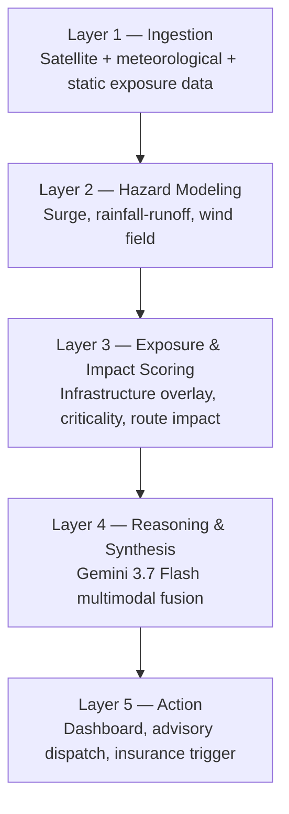
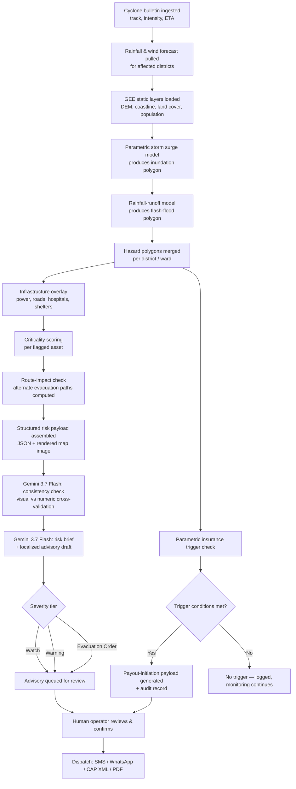

# Kavach — AI + Satellite + Structural-Physics Powered Anticipatory Disaster Intelligence

[]()
[]()
[]()
[]()
[]()
[]()

> **Detect → Forecast → Model Exposure → Assess Structure → Reason (Gemini) → Draft Advisory → Notify → Trigger Liquidity → Protect Lives & Livelihoods**

A national-scale anticipatory-action platform that fuses Google Earth Engine satellite data, real-time and forecast meteorological feeds, physics-based structural engineering models, and Gemini 3.7 Flash multimodal reasoning into one pipeline — turning a cyclone bulletin, a river gauge reading, or a seismic detection into a ward-level risk map, a ranked infrastructure-hardening list, a dispatch-ready advisory, and — where a policy is in force — an auditable parametric insurance trigger, all before or immediately after impact rather than weeks after.

This document is the complete, unabridged master plan: every phase of the technical build (MVP → backend hardening & structural engineering → real-time prediction & futureproofing → all-India multi-hazard expansion) and the startup business plan, merged into one file in build order, with nothing cut or summarized.

---

## Table of Contents

- [System Architecture (Full Stack, All Phases)](#system-architecture-full-stack-all-phases)
- [Judge / Pilot Demo Walkthrough](#judge--pilot-demo-walkthrough)
- [Documentation Index — How This Document Is Organized](#documentation-index--how-this-document-is-organized)
- [PART I — Foundational Build: Cyclone Anticipatory-Action MVP](#part-i--foundational-build-cyclone-anticipatory-action-mvp)
- [PART II — Backend Hardening, Structural/Mechanical Engineering Module & React Frontend Expansion](#part-ii--backend-hardening-structuralmechanical-engineering-module--react-frontend-expansion)
- [PART III — Real-Time Prediction for Upcoming Cyclones & Futureproof Architecture](#part-iii--real-time-prediction-for-upcoming-cyclones--futureproof-architecture)
- [PART IV — All-India Coverage, Multi-Hazard Expansion, Unified Notification Service & Standardized Dashboard](#part-iv--all-india-coverage-multi-hazard-expansion-unified-notification-service--standardized-dashboard)
- [PART V — Startup Business Plan](#part-v--startup-business-plan)
- [Contributors & Acknowledgements](#contributors--acknowledgements)

---

## System Architecture (Full Stack, All Phases)

```
                    ┌───────────────────────────────────────────────────────────┐
                    │                    INGESTION LAYER                       │
                    │  GEE (DEM, land cover, flood history, population, fire)  │
                    │  IMD / JTWC / GDACS / CWC / USGS-style feeds (+ Mock)    │
                    │  OSM exposure data (roads, power, hospitals, shelters)   │
                    └───────────────────────────┬───────────────────────────────┘
                                                 ▼
                    ┌───────────────────────────────────────────────────────────┐
                    │        PROVIDER ADAPTER REGISTRY  (mock ⇄ real, swappable)│
                    └───────────────────────────┬───────────────────────────────┘
                                                 ▼
   ┌─────────────────────────────────────────────────────────────────────────────────────┐
   │                    HAZARD MODULE REGISTRY (pluggable, per hazard_type)               │
   │  Cyclone (surge+track fx)  Flood  Landslide  Heatwave  Drought  Wildfire  Tsunami   │
   │  Earthquake (post-event impact only — never predictive)                             │
   └───────────────────────────────────────┬─────────────────────────────────────────────┘
                                            ▼
   ┌─────────────────────────────────────────────────────────────────────────────────────┐
   │        EXPOSURE & STRUCTURAL/MECHANICAL ENGINEERING SCORING ENGINE                   │
   │   Spatial exposure × criticality   |   Wind-load & hydrodynamic force physics        │
   │   Fragility curves (HAZUS-style)   |   Hardening-priority ranking                    │
   └───────────────────────────────────────┬─────────────────────────────────────────────┘
                                            ▼
   ┌─────────────────────────────────────────────────────────────────────────────────────┐
   │            GEMINI 3.7 FLASH MULTIMODAL REASONING CORE                                │
   │   Visual/numeric consistency check → Risk brief → Localized advisory → Trigger notice│
   └───────────────────────────────────────┬─────────────────────────────────────────────┘
                                            ▼
   ┌─────────────────────────────────────────────────────────────────────────────────────┐
   │     UNIFIED NOTIFICATION SERVICE          │   PARAMETRIC INSURANCE TRIGGER ENGINE    │
   │  Email · SMS · WhatsApp · CAP-XML · Push  │   Deterministic, structured-data-only,   │
   │  Subscriptions, digests, delivery tracking│   auditable payout-initiation signal     │
   └───────────────────────────────────┬───────┴─────────────────┬─────────────────────────┘
                                        ▼                         ▼
                    ┌───────────────────────────────────────────────────────────┐
                    │      STANDARDIZED NATIONAL DASHBOARD (React)              │
                    │  National → State → District → Ward drill-down            │
                    │  Live storm tracking · Hazard filters · Hardening lists   │
                    │  Human-in-the-loop review & dispatch on every action      │
                    └───────────────────────────────────────────────────────────┘
```

---

## Judge / Pilot Demo Walkthrough

| Step | State | Action & System Response | Expected Verification |
|---|---|---|---|
| **1** | Baseline | National dashboard loads with all-India map, no active severe events. | KPI row shows current active event count, all districts green/monitored. |
| **2** | Detection | Mock live feed advances: a new cyclone (`BOB07-2026`) appears in the Bay of Bengal with an initial track fix. | `LiveStormTracker` shows the new storm; `ProviderModeBadge` clearly reads "MOCK". |
| **3** | Forecast | Track/intensity extrapolation runs; a widening cone of uncertainty is drawn 24–120h out. | `StormTrackMap` shows dashed forecast track + shaded cone; confidence labeled "extrapolated". |
| **4** | Exposure | Threatened districts resolve dynamically from the cone; hazard polygons (surge + rainfall) generate per ward. | `RiskPanel` populates for every newly threatened district, not a hardcoded one. |
| **5** | Structural | Wind-load/fragility engine flags specific poles, shelters, and roads below safety factor 1.0. | `HardeningPriorityPage` shows a ranked list with named assets and safety factors. |
| **6** | Reasoning | Gemini cross-checks the hazard map against satellite imagery, then drafts a localized, tiered advisory. | `AdvisoryPreview` shows a draft with every figure traceable to the source JSON. |
| **7** | Human gate | Operator reviews and clicks confirm — nothing dispatches automatically. | Advisory moves from "Draft" to "Dispatched" only after explicit confirmation. |
| **8** | Dispatch | Notification Service sends via SMS/WhatsApp/email/CAP-XML to subscribed recipients. | `NotificationCenter` and `dispatch_log` show delivery status per channel. |
| **9** | Financial liquidity | Insurance trigger engine evaluates the same hazard data against a demo policy threshold and fires. | `InsuranceTriggerPanel` shows a triggered record with a full audit trail, timestamp, and model version. |

---

## Documentation Index — How This Document Is Organized

This master file merges five previously separate planning documents, in the order they were built, **in full, with no content cut or condensed**:

- **Part I** — the original hackathon-scoped MVP: architecture, GEE/meteorological data sources, the parametric surge and rainfall-runoff models, the exposure/criticality engine, Gemini integration, dispatch, project structure, and the 48-hour build plan.
- **Part II** — the audit of the real repository code, the structural/mechanical engineering fragility module (the flagship new capability), rapid post-event damage assessment via Gemini vision, backend productionization, and the React frontend expansion plan.
- **Part III** — real-time prediction for upcoming (not just historical) cyclones against a concrete mock dataset, and the futureproof architecture (provider adapters, model registry, basin configuration, API/schema versioning, feature flags) that lets a real data feed or a new region be added without rewriting the system.
- **Part IV** — the expansion to all-India geography, all eight disaster types via a shared `HazardModule` interface, the unified email/messaging Notification Service, and the standardized National → State → District → Ward dashboard.
- **Part V** — the startup business plan: market sizing, competitive landscape, business model, go-to-market, unit economics, funding ask, and 24-month milestones, grounded in current published market and disaster-impact data.

---


# PART I — Foundational Build: Cyclone Anticipatory-Action MVP

# Anticipatory Action Platform for Bay of Bengal & Coastal APAC Cyclones
### AI-Powered Predictive Risk, Vulnerability Modeling & Parametric Insurance Trigger Platform
### Full Implementation Plan

---

## 1. Executive Summary

Coastal communities around the Bay of Bengal and wider coastal APAC (India's east coast, Bangladesh, Myanmar, Sri Lanka, parts of Southeast Asia) face recurring cyclone landfalls where disaster response is largely **reactive** — search-and-rescue and relief after damage has already occurred, and insurance payouts that arrive months after a loss when they are least useful.

This platform shifts the response curve **left**, into the 24–120 hour pre-landfall window, by fusing four capabilities into a single decision pipeline:

1. **Storm surge simulation** — where the water will go
2. **Rainfall damage pathway prediction** — where flash floods and waterlogging will happen, independent of surge
3. **Critical infrastructure exposure mapping** — what gets hit (power grids, arterial roads, hospitals, shelters)
4. **Automated early-warning dispatch** — getting the right advisory to the right authority in time to act, plus a **parametric insurance liquidity trigger** so payouts can move *before* landfall rather than months after

The system is built on three technical pillars:

- **Google Earth Engine (GEE)** for satellite-derived terrain, land cover, coastal geometry, and historical flood calibration data
- **Real-time meteorological data** for cyclone track, intensity, and rainfall forecasts
- **Gemini 3.7 Flash multimodal reasoning** as the fusion layer that turns raw geospatial and numeric model output into a cross-checked, human-readable, jurisdiction-ready advisory — and a machine-readable trigger payload for parametric insurance contracts

The result is a single pipeline that, given a live or historical cyclone, can produce: a live risk map, a per-ward risk brief, a dispatch-ready advisory in the correct institutional format, and an auditable insurance-trigger record — end to end, in minutes rather than days.

---

## 2. Problem Statement & Scope

### 2.1 Core problem
Disaster management authorities (DDMAs), utilities, and insurers in the Bay of Bengal region currently rely on:
- Coarse, national-level cyclone bulletins that are not localized to ward/village level
- Manual, slow translation of meteorological bulletins into local evacuation orders
- Loss-adjuster-based insurance claims that take weeks to months to pay out, long after the liquidity was actually needed (immediately post-landfall)

### 2.2 In-scope for this build
- Bay of Bengal basin cyclones (India east coast, Bangladesh, Myanmar coast, Sri Lanka)
- Storm surge, rainfall-flood, and wind exposure — not earthquake, tsunami, or landslide
- District/ward-level granularity (the level at which DDMAs actually operate)
- A parametric insurance **trigger engine** (computing whether contractual trigger conditions are met and preparing the payout-initiation payload) — not the underwriting or claims-settlement process itself

### 2.3 Explicitly out of scope (state this clearly to judges)
- Fully certified, operational-grade hydrodynamic modeling (ADCIRC/SLOSH-equivalent accuracy) — the hackathon build uses a calibrated parametric proxy, with a clear upgrade path
- Real dispatch to real emergency numbers — all messaging demoed on sandbox/test channels
- Actual claims settlement or underwriting logic — only the trigger-detection and payout-initiation signal

---

## 3. Goals & Success Metrics

| Goal | Metric used in demo |
|---|---|
| Faster localization of risk | Time from "cyclone bulletin ingested" to "ward-level risk map generated" |
| Actionable, not just informative, output | Advisory includes named shelters, named roads, specific population counts — not just "heavy rain expected" |
| Trustworthy AI reasoning | Every number in a Gemini-generated advisory is traceable back to a specific upstream data field (no hallucinated figures) |
| Closing the financial protection gap | Insurance trigger payload generated automatically the moment modeled loss conditions are met, with full audit trail |
| Human accountability preserved | No advisory or insurance trigger is dispatched without an explicit human confirmation step in the loop |

---

## 4. System Architecture

### 4.1 Layered overview

The system is organized into five layers, each with a single responsibility, so any layer can be swapped out later (e.g., replacing the parametric surge model with ADCIRC) without touching the others.



### 4.2 Detailed pipeline (single clean top-down flow)

This is the same system drawn one level deeper, kept intentionally as one straight top-to-bottom flow with no crossing lines, so it is easy to narrate live during a demo.



### 4.3 Why this shape
- Every arrow moves in one direction only (ingestion → modeling → reasoning → action); nothing loops back except through the human-review gate, which is intentional and load-bearing for responsible deployment.
- The insurance trigger branches directly off the merged hazard layer (F), not off the AI-generated text, so a financial payout is never dependent on an LLM's phrasing — only on the underlying structured hazard data. Gemini only drafts the human-readable notification of the trigger.

---

## 5. Data Sources

### 5.1 Google Earth Engine collections

| Purpose | GEE Dataset | Notes |
|---|---|---|
| Elevation / coastal slope | `USGS/SRTMGL1_003`, `MERIT/DEM/v1_0_3` | Used for surge bathtub-fill and TWI |
| Coastline & surface water | `JRC/GSW1_4/GlobalSurfaceWater` | Coastal boundary + connectivity masking |
| Land cover / surface roughness | `ESA/WorldCover/v200` | Drives surge friction and rainfall permeability |
| Historical flood extent (calibration) | `GLOBAL_FLOOD_DB/MODIS_EVENTS/V1` | Used to backtest the surge/rainfall models against real past events |
| Population density | `WorldPop/GP/100m/pop`, `CIESIN/GPWv411` | Evacuation sizing per ward |
| Building footprints | `GOOGLE/Research/open-buildings/v3/polygons` | Shelter/infrastructure proxy where official data is missing |
| Nighttime lights | `NOAA/VIIRS/DNB/MONTHLY_V1/VCMSLCFG` | Proxy for active grid load / recovery tracking post-event |

### 5.2 Real-time meteorological & hazard feeds

| Country/Agency | Feed | Use |
|---|---|---|
| India — IMD (RSMC New Delhi) | Cyclone bulletins | Authoritative Bay of Bengal cyclone track/intensity source |
| Bangladesh — BMD | Bulletins | Regional cross-check |
| Myanmar — DMH | Bulletins | Regional cross-check |
| Sri Lanka — DMC | Bulletins | Regional cross-check |
| JTWC (US Navy/Air Force) | Track/intensity | Backup international source |
| GDACS | Aggregated alert feed | Fast machine-readable cross-agency alert ingestion |
| ECMWF Open Data | Numerical weather | Rainfall/wind field forecast |
| NOAA GFS (via NOMADS or Open-Meteo) | Numerical weather | Rainfall/wind field forecast, easier REST access for hackathon speed |

### 5.3 Static exposure layers

| Layer | Source | Notes |
|---|---|---|
| Roads (arterial/trunk) | OpenStreetMap via Overpass API | Tag filter `highway=primary/trunk/secondary` |
| Power lines & substations | OpenStreetMap | Tag filter `power=line/substation` |
| Hospitals & clinics | OpenStreetMap | Tag filter `amenity=hospital/clinic` |
| Cyclone shelters | Curated CSV per demo district | Falls back to community/school buildings from OSM where no official list exists |

### 5.4 Parametric insurance reference inputs
- Historical cyclone catalog (IBTrACS — International Best Track Archive for Climate Stewardship) for trigger-threshold calibration
- Modeled loss proxy from Section 6.3 (exposure × criticality) used as the parametric index, since real claims data is not available in a hackathon setting

---

## 6. Modeling Layer — Detailed Design

### 6.1 Storm Surge Simulator (parametric proxy)

Full hydrodynamic modeling (ADCIRC, SLOSH) is not buildable in a hackathon window. The build instead uses a **calibrated parametric proxy**, framed explicitly to judges as a *screening-speed model*, not a certified forecast:

1. **Surge height estimate** — regression against central pressure deficit, radius of maximum winds, and forward speed, calibrated against real historical Bay of Bengal cyclones (Amphan 2020, Fani 2019, Yaas 2021, Mocha 2023) pulled from IBTrACS + post-event surge survey reports
2. **Shelf amplification factor** — derived from GEE bathymetry/elevation slope near the predicted landfall point; shallow, funnel-shaped coasts (Odisha coast, Bangladesh delta, Rakhine coast) amplify the base surge estimate
3. **Bathtub-fill with connectivity constraint** — the estimated surge height is applied as a fill over the coastal DEM within a buffered landfall radius, using flow-connectivity (flood-fill) to the open sea so that isolated, unconnected low-lying pixels are not falsely flagged
4. **Output** — a GeoJSON inundation polygon with a surge-height attribute per zone

### 6.2 Rainfall-Runoff / Flash-Flood Pathway Model

1. Pull rainfall forecast grid (mm over next 24/48/72h)
2. Compute Topographic Wetness Index (TWI) from the GEE DEM (`ee.Terrain.slope`, flow accumulation approximation)
3. Combine into a runoff risk score:
   `runoff_risk = f(rainfall_intensity, TWI, land_cover_permeability)`
4. Threshold into Low / Medium / High / Severe classes, vectorized into per-cell polygons, merged with the surge polygon into one hazard layer per ward

### 6.3 Exposure & Criticality Scoring Engine

For every infrastructure asset from Section 5.3:

```
exposure_score    = spatial_overlap(asset_geometry, hazard_polygon)
criticality_score = weighted(asset_type, population_served, redundancy)
priority_score    = exposure_score × criticality_score
```

- Hospitals/shelters inside a hazard polygon → flagged **CRITICAL — relocate or resupply**
- Roads inside a hazard polygon → flagged **evacuation route may be cut**; `route_impact.py` recomputes shortest path from population centroid to nearest unflagged shelter using `osmnx`/`networkx` with flagged edges removed
- Power lines/substations inside a high-wind or surge zone → flagged **preemptive shutdown candidate**, to reduce post-landfall electrocution/fire risk

### 6.4 Parametric Insurance Liquidity Trigger Engine (core module, not a stretch goal)

This directly answers the "parametric insurance liquidity" requirement in the brief.

**Concept:** instead of waiting for a loss-adjuster to visit a site after landfall, define trigger conditions **before landfall**, tied to modeled physical parameters, and fire the trigger automatically the moment those parameters are forecast/observed to be met.

**Trigger schema (per insured zone):**
```json
{
  "policy_id": "string",
  "zone_id": "string",
  "trigger_type": "surge_height | rainfall_total | wind_speed | composite_loss_index",
  "threshold": "number",
  "observed_or_forecast_value": "number",
  "confidence": "forecast | observed",
  "triggered": "boolean",
  "trigger_timestamp": "ISO8601",
  "source_model_version": "string"
}
```

**Flow:**
1. Trigger engine subscribes to the same merged hazard layer used by the exposure scoring module (Section 4.2, node F)
2. For each insured zone, compares modeled surge height / rainfall total / composite loss index against the policy's pre-agreed threshold
3. If met, generates a signed, timestamped trigger record (the payout-initiation payload) — this is a **notification and audit artifact**, not an actual funds transfer, since real payment rails are out of scope for a hackathon
4. Gemini drafts a plain-language trigger notification for the insurer/reinsurer and the covered community, but the trigger boolean itself is computed purely from structured data — never from LLM output — so the financial decision is deterministic and auditable

This closes the loop the challenge brief describes: pre-landfall evacuation planning **and** pre-landfall financial liquidity, from the same hazard model.

---

## 7. Gemini 3.7 Flash Multimodal Reasoning Layer

Gemini is used as a **fusion and translation layer**, not a chatbot bolt-on. It sits between structured model output and every human-facing or institution-facing document the system produces.

### 7.1 Inputs given to Gemini per ward/zone
- A rendered map (satellite base + hazard overlay + flagged infrastructure), generated server-side and passed as an image
- A structured JSON payload: surge height, rainfall totals, flagged assets with scores, population count, cyclone category and ETA, insurance trigger status
- District/administrative and language context, for localization

### 7.2 Gemini tasks

**Task A — Visual/numeric consistency check**
Cross-checks whether the modeled hazard polygon is geomorphologically plausible against the visible image (e.g., flags a polygon that crosses a visible ridge line, or that floods an area the imagery shows as elevated high ground). This is a sanity-check pass that exploits multimodal reasoning specifically — a text-only model cannot do this.

**Task B — Risk narrative generation**
Converts numeric scores into a structured, ward-level brief, e.g.:
> "Ward 7 (population ~12,000): surge height 2.4m expected, coinciding with the only paved access road to Community Shelter #3. Recommend evacuation start at T-36h."

**Task C — Advisory drafting**
Produces a dispatch-ready advisory following the applicable national advisory template (e.g., NDMA/IMD format for India), in English plus the relevant regional language, at one of three severity tiers: **Watch / Warning / Evacuation Order**.

**Task D — Insurance trigger notification drafting**
Converts a fired trigger record (Section 6.4) into a plain-language notice for insurers and covered communities, explaining what threshold was crossed and what happens next.

**Task E — Operator Q&A / explainability**
Answers follow-up questions from a human operator ("why is this shelter flagged?") by reasoning over the same structured context already assembled — this is what makes the system feel like an analyst rather than a black box, and is what builds operator trust fast enough to actually be used under time pressure.

### 7.3 Prompt design principle (stated explicitly to judges)
Every prompt is constrained to **forbid inventing any number not present in the supplied JSON**, and every generated document carries a machine-checkable footer mapping each figure back to its source field. A lightweight post-generation validator (`ai-reasoning/validate_output.py`) re-parses the generated text and checks any numeric mentions against the source payload before the document is allowed into the human-review queue.

### 7.4 Example prompt skeletons

**Consistency check:**
```
SYSTEM: You are a disaster-risk analyst assistant. You are given a map image
showing a modeled flood/surge extent over a district, and structured JSON
describing that same extent numerically. Check whether the shape of the
polygon is plausible given the visible terrain in the image. Flag any
specific area where the modeled hazard does not match visible topography.
Do not invent data not present in the JSON.

USER: [map image] + {hazard JSON for Ward 7}
```

**Advisory drafting:**
```
SYSTEM: You are drafting an official disaster advisory for a District
Disaster Management Authority, following the [national advisory template].
Use only the values present in the supplied JSON. State the severity tier,
affected wards, named critical assets at risk, and the recommended
evacuation window. Produce the advisory in English and in [regional
language]. Do not add any figure not present in the input.

USER: {ward risk payload, JSON} + severity_tier: "Warning"
```

**Insurance trigger notice:**
```
SYSTEM: You are drafting a parametric insurance trigger notification.
Explain, in plain language, which threshold was crossed, the modeled
value that crossed it, and that a payout-initiation process has begun.
Do not state or imply a payout amount or timeline not present in the
input payload.

USER: {trigger record JSON from Section 6.4}
```

---

## 8. Early-Warning & Insurance Dispatch Automation

| Channel | Use case | Implementation |
|---|---|---|
| SMS | Field-level alerts to DDMA officers / shelter managers | Twilio API, sandbox numbers for demo |
| WhatsApp | Structured advisory with map snippet | WhatsApp Business Cloud API, test number |
| CAP (Common Alerting Protocol) XML | Interop with official warning systems (e.g., India's Sachet platform) | Valid CAP 1.2 XML generated and exported — demonstrates standards compliance even without live federation |
| Email / PDF | Formal institutional record | Auto-generated PDF advisory (`weasyprint`/`reportlab`) |
| Insurer webhook | Parametric trigger notification | Signed JSON POST to a mock insurer endpoint, simulating a real payout-initiation call |

**Escalation logic:** advisory tier (Watch → Warning → Evacuation Order) escalates automatically as time-to-landfall shortens and/or criticality scores rise, but **no dispatch — advisory or insurance trigger notification — leaves the system without an explicit human confirmation click.** This is a deliberate design choice, not a limitation: full autonomy over evacuation orders or fund releases is not appropriate even in a production system, and stating this clearly is itself a strength in front of judges.

---

## 9. Database Schema (PostgreSQL + PostGIS)

```sql
CREATE TABLE districts (
    district_id     TEXT PRIMARY KEY,
    country         TEXT NOT NULL,
    name            TEXT NOT NULL,
    geom            GEOMETRY(MultiPolygon, 4326)
);

CREATE TABLE wards (
    ward_id         TEXT PRIMARY KEY,
    district_id     TEXT REFERENCES districts(district_id),
    name            TEXT NOT NULL,
    population      INTEGER,
    geom            GEOMETRY(MultiPolygon, 4326)
);

CREATE TABLE cyclone_events (
    event_id        TEXT PRIMARY KEY,
    name            TEXT,
    source          TEXT,               -- IMD, JTWC, GDACS, etc.
    category        TEXT,
    eta             TIMESTAMPTZ,
    track_geom      GEOMETRY(LineString, 4326),
    ingested_at     TIMESTAMPTZ DEFAULT now()
);

CREATE TABLE hazard_polygons (
    hazard_id       TEXT PRIMARY KEY,
    event_id        TEXT REFERENCES cyclone_events(event_id),
    ward_id         TEXT REFERENCES wards(ward_id),
    hazard_type     TEXT,               -- surge | rainfall_flood
    severity_class  TEXT,
    attribute_value NUMERIC,            -- surge height (m) or rainfall (mm)
    geom            GEOMETRY(MultiPolygon, 4326),
    model_version   TEXT,
    created_at      TIMESTAMPTZ DEFAULT now()
);

CREATE TABLE infrastructure_assets (
    asset_id        TEXT PRIMARY KEY,
    ward_id         TEXT REFERENCES wards(ward_id),
    asset_type      TEXT,               -- hospital | shelter | road | power_line | substation
    name            TEXT,
    criticality     NUMERIC,
    geom            GEOMETRY(Geometry, 4326)
);

CREATE TABLE exposure_scores (
    score_id        TEXT PRIMARY KEY,
    event_id        TEXT REFERENCES cyclone_events(event_id),
    asset_id        TEXT REFERENCES infrastructure_assets(asset_id),
    exposure_score  NUMERIC,
    priority_score  NUMERIC,
    computed_at     TIMESTAMPTZ DEFAULT now()
);

CREATE TABLE advisories (
    advisory_id     TEXT PRIMARY KEY,
    event_id        TEXT REFERENCES cyclone_events(event_id),
    ward_id         TEXT REFERENCES wards(ward_id),
    severity_tier   TEXT,               -- Watch | Warning | Evacuation Order
    content_en      TEXT,
    content_local   TEXT,
    generated_by    TEXT DEFAULT 'gemini-3.7-flash',
    reviewed_by     TEXT,
    dispatched_at   TIMESTAMPTZ
);

CREATE TABLE insurance_triggers (
    trigger_id      TEXT PRIMARY KEY,
    policy_id       TEXT,
    zone_id         TEXT,
    event_id        TEXT REFERENCES cyclone_events(event_id),
    trigger_type    TEXT,
    threshold_value NUMERIC,
    observed_value  NUMERIC,
    triggered       BOOLEAN,
    trigger_timestamp TIMESTAMPTZ,
    audit_hash      TEXT
);

CREATE TABLE dispatch_log (
    dispatch_id     TEXT PRIMARY KEY,
    advisory_id     TEXT REFERENCES advisories(advisory_id),
    channel         TEXT,               -- sms | whatsapp | cap_xml | pdf | insurer_webhook
    recipient       TEXT,
    status          TEXT,
    dispatched_at   TIMESTAMPTZ DEFAULT now()
);
```

---

## 10. API Contract (FastAPI backend)

| Method | Endpoint | Purpose |
|---|---|---|
| `POST` | `/ingest/cyclone-event` | Register a new cyclone bulletin (track, intensity, ETA) |
| `GET` | `/risk/{district_id}` | Return merged hazard polygons + exposure scores for a district |
| `GET` | `/risk/{district_id}/wards/{ward_id}` | Ward-level detail: hazard values, flagged assets, route impact |
| `POST` | `/advisory/generate` | Trigger Gemini advisory generation for a given ward + event |
| `POST` | `/advisory/{advisory_id}/review` | Human operator approves/edits a draft advisory |
| `POST` | `/advisory/{advisory_id}/dispatch` | Send an approved advisory via selected channel(s) |
| `GET` | `/insurance/triggers/{event_id}` | List insurance trigger evaluations for an event |
| `POST` | `/insurance/triggers/{trigger_id}/notify` | Dispatch a trigger notification to insurer webhook |
| `GET` | `/assets/{district_id}` | List infrastructure assets and current criticality scores |

**Example — `GET /risk/{district_id}` response (abridged):**
```json
{
  "district_id": "IN-OD-PURI",
  "event_id": "CYCLONE-FANI-2019",
  "wards": [
    {
      "ward_id": "WARD-07",
      "population": 12000,
      "surge_height_m": 2.4,
      "rainfall_mm_48h": 180,
      "severity_tier": "Warning",
      "flagged_assets": [
        {"asset_id": "SHELTER-03", "type": "shelter", "priority_score": 0.91},
        {"asset_id": "ROAD-12", "type": "road", "priority_score": 0.77}
      ]
    }
  ]
}
```

---

## 11. Tech Stack

| Layer | Choice | Rationale |
|---|---|---|
| Geospatial processing | `earthengine-api`, `geemap`, `geopandas`, `shapely`, `rasterio` | Direct satellite access, no bulk download needed; standard geospatial toolchain |
| Backend | Python, FastAPI | Fast to build, async-native, strong geospatial library support |
| AI reasoning | Gemini 3.7 Flash via Google AI Studio / Vertex AI SDK | Multimodal, low latency, cost-efficient for high-frequency re-runs as forecasts update |
| Routing/network analysis | `osmnx`, `networkx` | Road exposure and alternate-route computation |
| Database | PostgreSQL + PostGIS (Supabase for fast hackathon setup) | Standard geospatial store, generous free tier |
| Frontend | React + MapLibre GL / deck.gl | Interactive layered map dashboard, no vendor lock-in |
| Messaging | Twilio (SMS), WhatsApp Business Cloud API | Sandbox mode works without account approval, fast integration |
| Auth | Auth0 or Supabase Auth | Fast to wire up, role-based access for DDMA operators vs. insurer viewers |
| Hosting | Vercel (frontend) + Cloud Run (backend) | Free tiers, fast deploy for demo day |
| Orchestration | Cloud Scheduler / simple cron | Periodic re-run as cyclone forecasts update |
| Observability | Sentry (errors) + a simple structured-logging dashboard | Needed once the trigger engine handles anything insurance-adjacent |
| Testing | `pytest`, `pytest-cov`, historical backtest notebooks | Both unit correctness and model validity against real past cyclones |

---

## 12. Project Structure

```
cyclone-anticipatory-platform/
├── README.md
├── .env.example
├── docker-compose.yml
├── infra/
│   ├── terraform/
│   │   ├── cloud_run.tf
│   │   ├── postgis_instance.tf
│   │   └── scheduler.tf
│   └── github-actions/
│       ├── ci.yml
│       └── deploy.yml
│
├── data-ingestion/
│   ├── gee/
│   │   ├── auth.py                    # GEE service account auth
│   │   ├── terrain.py                 # DEM, slope, TWI extraction
│   │   ├── landcover.py               # land cover + permeability classes
│   │   ├── historical_floods.py       # historical flood extent pulls (calibration)
│   │   └── exports.py                 # export GEE layers as GeoTIFF/GeoJSON
│   ├── weather/
│   │   ├── cyclone_track.py           # IMD/BMD/DMH/DMC/JTWC/GDACS fetch & parse
│   │   ├── rainfall_forecast.py       # Open-Meteo / GFS / ECMWF rainfall grid fetch
│   │   └── schemas.py                 # pydantic models for weather payloads
│   └── exposure/
│       ├── osm_extract.py             # roads, hospitals, power lines via Overpass
│       └── shelters.py                # curated/known shelter dataset loader
│
├── modeling/
│   ├── surge/
│   │   ├── parametric_surge.py        # empirical surge height + bathtub fill
│   │   └── calibration/               # IBTrACS-based historical calibration notebooks
│   ├── rainfall_runoff/
│   │   └── flash_flood_model.py       # TWI-based runoff risk scoring
│   ├── exposure_scoring/
│   │   ├── asset_overlay.py           # spatial join assets <-> hazard polygons
│   │   ├── criticality.py             # weighting logic per asset type
│   │   └── route_impact.py            # osmnx shortest-path w/ flagged edges removed
│   └── insurance_trigger/
│       ├── trigger_engine.py          # threshold comparison + audit record generation
│       ├── policy_schemas.py          # policy_id, zone_id, trigger_type, threshold
│       └── payout_payload.py          # builds signed payout-initiation payload
│
├── ai-reasoning/
│   ├── gemini_client.py               # Vertex AI / AI Studio SDK wrapper
│   ├── prompts/
│   │   ├── consistency_check.md
│   │   ├── risk_brief.md
│   │   ├── advisory_draft.md
│   │   └── insurance_trigger_notice.md
│   ├── map_render.py                  # render map image for multimodal input
│   ├── advisory_generator.py          # orchestrates: risk data -> Gemini -> advisory object
│   └── validate_output.py             # post-generation numeric consistency validator
│
├── dispatch/
│   ├── cap_alert.py                   # build CAP 1.2 XML
│   ├── sms_dispatch.py                # Twilio integration
│   ├── whatsapp_dispatch.py           # WhatsApp Cloud API integration
│   ├── pdf_report.py                  # formal advisory PDF generation
│   ├── insurer_webhook.py             # payout-initiation webhook call
│   └── dispatch_orchestrator.py       # tier logic + human-in-the-loop gate
│
├── backend/
│   ├── main.py                        # FastAPI app entrypoint
│   ├── routers/
│   │   ├── ingest.py
│   │   ├── risk.py
│   │   ├── advisory.py
│   │   ├── insurance.py
│   │   └── assets.py
│   ├── db/
│   │   ├── models.py                  # SQLAlchemy + PostGIS models
│   │   ├── migrations/
│   │   └── session.py
│   ├── auth/
│   │   └── rbac.py                    # DDMA operator vs. insurer viewer roles
│   └── config.py
│
├── frontend/
│   ├── src/
│   │   ├── components/
│   │   │   ├── MapView.tsx            # MapLibre/deck.gl layered map
│   │   │   ├── RiskPanel.tsx          # per-ward risk cards
│   │   │   ├── AdvisoryPreview.tsx    # Gemini-generated advisory preview + edit
│   │   │   ├── DispatchControls.tsx   # human-in-the-loop send button
│   │   │   └── InsuranceTriggerPanel.tsx  # trigger status + notify control
│   │   ├── pages/
│   │   │   ├── Dashboard.tsx
│   │   │   └── AdminPanel.tsx
│   │   └── api/client.ts
│   └── package.json
│
├── tests/
│   ├── unit/
│   │   ├── test_surge_model.py
│   │   ├── test_runoff_model.py
│   │   ├── test_exposure_scoring.py
│   │   └── test_trigger_engine.py
│   ├── integration/
│   │   └── test_end_to_end_pipeline.py
│   └── prompt_eval/
│       └── test_advisory_numeric_consistency.py
│
├── notebooks/
│   ├── 01_gee_exploration.ipynb
│   ├── 02_surge_calibration.ipynb
│   ├── 03_insurance_trigger_backtest.ipynb
│   └── 04_demo_district_walkthrough.ipynb
│
└── docs/
    ├── architecture.md
    ├── data_sources.md
    ├── advisory_template_ndma.md
    ├── insurance_trigger_spec.md
    └── demo_script.md
```

---

## 13. Non-Functional Requirements

| Category | Target (hackathon demo) | Target (production direction) |
|---|---|---|
| Latency, ingestion → risk map | < 60 seconds for a single district | < 5 minutes nationwide |
| Latency, risk map → advisory draft | < 15 seconds per ward | < 30 seconds per ward |
| Availability | Best-effort for demo | 99.9%, multi-region |
| Data retention | Session-only / demo database | Full audit trail, especially for insurance triggers |
| Localization | English + 1 regional language | All Bay of Bengal regional languages |

---

## 14. Security, Privacy & Responsible AI Considerations

- **No autonomous dispatch:** every advisory and every insurance trigger notification requires an explicit human confirmation click before leaving the system (see Section 8) — this is a hard architectural constraint, not a configurable setting.
- **Deterministic financial logic:** the insurance trigger boolean (Section 6.4) is computed from structured hazard data only; Gemini never determines whether a trigger fires, only how it is explained.
- **Numeric grounding:** all Gemini-generated documents pass through a post-generation validator (`validate_output.py`) that checks every number against the source JSON before the document can enter the human-review queue.
- **PII minimization:** population figures are used in aggregate (ward-level counts), never individual-level data.
- **Role-based access:** DDMA operators, insurer viewers, and admin roles are separated via RBAC; insurer-facing views never expose raw citizen contact data used for SMS/WhatsApp dispatch.
- **Auditability:** every dispatched advisory and every fired insurance trigger is logged with a timestamp, source model version, and reviewing operator ID (`dispatch_log`, `insurance_triggers` tables).

---

## 15. Testing & Validation Strategy

| Test type | What it checks |
|---|---|
| Unit tests (`tests/unit/`) | Surge model, runoff model, exposure scoring, and trigger engine each produce correct output for known synthetic inputs |
| Integration test (`tests/integration/`) | Full pipeline run, ingestion → dispatch, against a historical cyclone, checked for no unhandled exceptions and sane output ranges |
| Historical backtesting (`notebooks/02`, `notebooks/03`) | Surge/runoff model output compared against real historical flood extent (GEE `GLOBAL_FLOOD_DB`) and real insurance-relevant thresholds for Amphan, Fani, Yaas, Mocha |
| Prompt evaluation (`tests/prompt_eval/`) | Every Gemini-generated advisory is checked programmatically for numeric figures not present in the source payload — a failing test here blocks the advisory from the review queue |

---

## 16. Demo Scenario Design

Replay a **real, well-documented historical cyclone** so the demo is falsifiable and credible, rather than a synthetic toy example.

**Recommended: Cyclone Fani (2019, Odisha, India)** — India's real evacuation of roughly 1.2 million people is a strong "here is what we could have done faster and more precisely" narrative, and IMD documentation is relatively accessible for calibration.

**Secondary scenario for multi-country credibility: Cyclone Mocha (2023, Myanmar/Bangladesh, Rakhine coast)** — demonstrates the platform is not India-only, and highlights the humanitarian stakes in a lower-resource-data environment.

**Demo flow:**
1. Load the historical track at T-72h before actual landfall
2. Generate the live ward-level hazard overlay for the real affected district
3. Show flagged real infrastructure (a real hospital/shelter/road from OSM)
4. Show the Gemini-generated risk brief and the drafted, localized advisory
5. Show the parametric insurance trigger firing, with the drafted notification
6. Show simulated dispatch (Twilio SMS to a demo phone, generated CAP XML, mock insurer webhook call)
7. Close with a single measured number: "This ran in under X seconds from bulletin ingestion to a dispatch-ready advisory and a fired insurance trigger."

---

## 17. Build Plan

### 17.1 Hackathon build (36–48 hour window)

| Phase | Hours | Tasks |
|---|---|---|
| Setup | 0–4 | Repo scaffold, GEE service account, API keys (Gemini, Twilio, weather), pick demo district + cyclone |
| Data pipeline | 4–12 | GEE DEM/land cover export; OSM asset extraction; historical cyclone track loaded |
| Core hazard models | 12–22 | Parametric surge model + bathtub fill; rainfall-runoff scoring; exposure/criticality scoring |
| Insurance trigger engine | 20–26 | Threshold schema, trigger comparison logic, audit record generation |
| AI reasoning layer | 22–30 | Gemini integration: consistency check, risk brief, advisory draft, trigger notice; prompt iteration |
| Dispatch + backend API | 26–34 | FastAPI endpoints; Twilio/CAP XML/PDF generation; insurer webhook mock |
| Frontend dashboard | 22–36 | Map view with layered overlays; risk panel; advisory + trigger review/edit UI |
| Integration + demo polish | 34–44 | End-to-end run on chosen historical cyclone; fix edge cases; rehearse demo |
| Buffer / pitch prep | 44–48 | Slides, README, backup recording of the full demo run |

### 17.2 Post-hackathon roadmap (first 90 days, for the pitch's closing slide)

| Phase | Focus |
|---|---|
| Weeks 1–3 | Replace parametric surge model with a coupled shallow-water solver (e.g., GeoClaw) for higher-fidelity inundation extent |
| Weeks 3–6 | Formal integration with a national alert system (e.g., India's Sachet platform) and real insurer sandbox API |
| Weeks 6–10 | Multi-country expansion: Bangladesh and Myanmar exposure datasets, regional language advisory templates |
| Weeks 10–13 | Post-event feedback loop: validate modeled hazard extent and fired triggers against real damage/claims reports, recalibrate thresholds |

---

## 18. Team Roles

| Role | Focus |
|---|---|
| Geospatial/GEE engineer | Sections 5, 6.1–6.3 (`data-ingestion/gee`, `modeling/surge`, `modeling/rainfall_runoff`) |
| Backend engineer | FastAPI, PostGIS schema, dispatch orchestration, RBAC |
| AI/prompt engineer | Gemini integration, prompt design, output validator, advisory template fidelity |
| Insurance/actuarial-minded teammate | Trigger schema design, threshold calibration, insurer-facing notification content |
| Frontend engineer | Dashboard, map layering, advisory/trigger review UX |
| Domain/pitch lead | Historical cyclone research, demo narrative, judging Q&A prep |

---

## 19. Cost & Infrastructure Estimate (hackathon + first 90 days)

| Item | Hackathon cost | Early-production monthly estimate |
|---|---|---|
| Google Earth Engine | Free (research/nonprofit tier) | Free tier likely sufficient at pilot scale |
| Gemini 3.7 Flash API | Free/low-cost hackathon credits | Usage-based, low per-call cost at Flash tier |
| Twilio (SMS sandbox) | Free sandbox | Pay-per-message once out of sandbox |
| WhatsApp Business API | Free test tier | Pay-per-conversation at scale |
| Supabase (Postgres + Auth) | Free tier | Low fixed monthly cost at pilot scale |
| Hosting (Vercel + Cloud Run) | Free tier | Low fixed monthly cost at pilot scale |

---

## 20. Judging-Criteria Alignment

| Criterion | How this plan addresses it |
|---|---|
| Technical depth | Real GEE pipelines, genuine (if intentionally simplified) physical modeling, a deterministic insurance-trigger engine — not a UI mockup |
| Novel use of AI | Gemini as a multimodal fusion and cross-validation layer, drafting real institutional and financial documents — not a wrapper chatbot |
| Real-world impact | Anchored to real historical cyclones with real population and infrastructure at stake; closes both the evacuation-planning and financial-liquidity gaps named in the brief |
| Feasibility/completeness | Full pipeline demoable live: ingestion → modeling → reasoning → dispatch → insurance trigger |
| Responsible deployment | Explicit human-in-the-loop gate on every dispatch and every trigger; deterministic (non-LLM) financial logic |
| Scalability | Modular, swappable layers; same architecture extends to Bangladesh, Myanmar, Sri Lanka without redesign |

---

## 21. Key Risks & Mitigations

| Risk | Mitigation |
|---|---|
| GEE quota/auth issues mid-hackathon | Pre-export needed layers to local GeoTIFF/GeoJSON early as a fallback cache |
| Live meteorological APIs rate-limited or down during demo | Historical cyclone replay is the primary demo path; live feed is a bonus toggle |
| Surge model accused of being "not scientific enough" | State upfront it is a calibrated screening-speed proxy, with a named roadmap to ADCIRC/GeoClaw-grade modeling |
| Gemini hallucinating numbers in advisories or trigger notices | Prompts explicitly forbid inventing data; post-generation numeric validator blocks ungrounded output before human review |
| Insurance trigger logic perceived as a "black box" | Trigger boolean is computed from structured, inspectable data only, with a full audit record — deliberately never delegated to the LLM |
| Dispatch demo looking like it could send real false alarms or real payouts | Always demo on sandbox numbers and a mock insurer endpoint, with a visible human-confirmation click |

---

## 22. Glossary

| Term | Meaning |
|---|---|
| DDMA | District Disaster Management Authority |
| GEE | Google Earth Engine |
| DEM | Digital Elevation Model |
| TWI | Topographic Wetness Index |
| CAP | Common Alerting Protocol (international alert message standard) |
| IBTrACS | International Best Track Archive for Climate Stewardship (historical cyclone track database) |
| Parametric insurance | Insurance that pays out automatically when a predefined, measurable trigger condition is met, rather than after a manual loss assessment |
| RBAC | Role-Based Access Control |

---

## 23. Appendix — Sample Outputs

**Sample generated advisory (English, Warning tier):**
> WARNING — Ward 7, Puri District. Cyclone [name] expected surge height 2.4m within 36 hours. Community Shelter #3 access road (Road-12) is at risk of being cut off. Residents in the surge zone are advised to relocate to Community Shelter #3 before the access road is affected. Estimated population in the affected zone: 12,000.

**Sample insurance trigger notice:**
> TRIGGER NOTICE — Policy [policy_id], Zone [zone_id]. Modeled surge height of 2.6m has crossed the contractual trigger threshold of 2.0m as of [timestamp]. Payout-initiation process has begun under source model version [version]. This notice is generated from structured hazard data and is subject to policy terms.

**Sample CAP alert (structure only):**
```xml
<alert xmlns="urn:oasis:names:tc:emergency:cap:1.2">
  <identifier>CYCLONE-FANI-2019-WARD07-001</identifier>
  <sender>anticipatory-action-platform@example.org</sender>
  <status>Actual</status>
  <msgType>Alert</msgType>
  <scope>Public</scope>
  <info>
    <event>Cyclone Storm Surge Warning</event>
    <urgency>Expected</urgency>
    <severity>Severe</severity>
    <certainty>Likely</certainty>
    <area>
      <areaDesc>Ward 7, Puri District</areaDesc>
    </area>
  </info>
</alert>
```

---

# PART II — Backend Hardening, Structural/Mechanical Engineering Module & React Frontend Expansion

# Climate_Predection — Phase 2 Enhancement Plan
### Backend hardening, new features, structural/mechanical engineering module, and React frontend expansion

This plan builds directly on the existing `Lolimancer-07/Climate_Predection` codebase (verified against the actual repo, not the abstract design doc). It assumes the Phase 1 scaffold already works as a single-scenario demo (Cyclone Fani 2019, district `IN-OD-PURI`, Ward 7) and turns it into a generalizable, multi-feature platform.

---

## 1. Current State — What's Actually in the Repo

| Area | What exists today | What's missing |
|---|---|---|
| Backend | FastAPI app (`backend/main.py`), 5 routers, SQLAlchemy+GeoAlchemy2 models, RBAC stub | Routers bypass the DB entirely and return hardcoded demo objects; no real query path |
| Modeling | Real parametric surge model (`modeling/surge/parametric_surge.py`) with calibration constants, rainfall-runoff, exposure scoring, insurance trigger engine | Only one hardcoded scenario (`fani_demo_surge()`); no generalized "run for any district/event" entrypoint used by the API |
| AI reasoning | Gemini client, prompt templates, output validator | Not yet wired to accept dynamically computed risk payloads — only demo-shaped input |
| Frontend | Real React 18 + Vite + TypeScript app, MapLibre GL via `react-map-gl`, TanStack Query, Axios | Single fixed view; no district/scenario selector, no timeline, no layer toggles, no role-based views |
| Dispatch | CAP XML, SMS, WhatsApp, PDF, insurer webhook modules exist | Not connected to a live human-review queue; no persistence of dispatch history |
| Tests | Unit tests for surge/runoff/exposure/trigger, one integration test | No frontend tests, no load/perf tests, no prompt-regression suite beyond one file |

**Conclusion:** the physics and AI logic are real and worth keeping — the priority for Phase 2 is (a) generalizing it beyond one hardcoded case, (b) adding genuine new capability (the structural/mechanical module is the biggest one), and (c) building out the React frontend to actually expose all of this.

---

## 2. Flagship New Feature: Structural & Mechanical Engineering Stress Module

### 2.1 Why this fits, directly

The original brief asks for infrastructure **exposure mapping** (power grids, roads, shelters). The current repo only answers *"is this asset inside the flood/surge polygon?"* — a purely spatial question. It never asks *"will this specific structure actually survive the forecast wind and water forces?"* — a **mechanical/structural engineering** question. Adding that turns exposure mapping into genuine infrastructure-hardening decision support, which is explicitly called out in the problem statement.

### 2.2 Core physics (all standard, textbook wind/structural engineering — no exotic modeling needed)

**Wind load on a structure (drag force):**
```
F_wind = 0.5 * Cd * rho_air * A * V^2
```
- `Cd` = drag coefficient (asset-type dependent: ~1.2 for flat-sided buildings, ~1.0 for cylindrical poles, ~2.0 for open lattice transmission towers)
- `rho_air` ≈ 1.225 kg/m³
- `A` = projected frontal area of the structure
- `V` = forecast sustained wind speed at the asset's location (already available from the meteorological ingestion layer)

**Hydrodynamic surge force on a structure (debris-laden flow):**
```
F_surge = 0.5 * Cd_water * rho_water * A_submerged * V_flow^2
```
plus a hydrostatic component for fully/partially submerged walls. `V_flow` is estimated from surge height and local terrain slope (already computed by the existing surge model).

**Structural check for line assets (power poles / transmission towers):**
```
bending_moment = F_wind * height_of_application
safety_factor  = pole_material_capacity_moment / bending_moment
```
Standard mechanics-of-materials bending-moment vs. section-modulus check, parameterized per pole/tower class (wood pole, concrete pole, steel lattice tower) using published capacity values.

**Fragility curve (probability of a given damage state, HAZUS-style):**
```
P(damage_state | V) = Φ( ln(V / median_threshold) / dispersion_beta )
```
A lognormal cumulative distribution — the standard form used in earthquake and hurricane engineering risk models (HAZUS-MH, FEMA). Each asset class (RCC-frame hospital, masonry school/shelter, thatched-roof house, wood power pole, steel transmission tower, concrete bridge pier) gets its own `(median_threshold, dispersion_beta)` pair, sourced from published regional vulnerability studies where available, and conservatively estimated where not, with the estimation method documented.

### 2.3 Output

For every flagged asset, in addition to the existing `priority_score`:
```json
{
  "asset_id": "POLE-0231",
  "asset_class": "wood_power_pole",
  "forecast_wind_speed_kmh": 165,
  "wind_force_kn": 12.4,
  "safety_factor": 0.71,
  "damage_state_probabilities": {
    "none": 0.05, "minor": 0.18, "moderate": 0.34, "severe": 0.31, "collapse": 0.12
  },
  "expected_damage_state": "moderate",
  "hardening_recommendation": "Guy-wire reinforcement recommended pre-landfall; safety factor below 1.0."
}
```

This feeds three places at once:
1. **Exposure scoring** — `priority_score` becomes physics-informed, not purely spatial
2. **Insurance trigger engine** — a new `trigger_type: "structural_damage_index"` becomes possible, aggregating expected damage state across an insured zone's assets
3. **A new "Hardening Priority List"** — a ranked, exportable list of exactly which poles/roofs/bridges to reinforce before landfall, sorted by (safety factor ascending × criticality descending)

### 2.4 New module structure

```
modeling/structural_engineering/
├── __init__.py
├── wind_load.py            # F_wind calculation per asset class
├── hydrodynamic_load.py     # F_surge calculation
├── fragility_curves.py      # lognormal P(damage_state | load), per asset class parameter table
├── structural_check.py      # bending moment / safety factor for line assets
├── damage_state.py          # aggregates load + fragility -> expected damage state
└── hardening_priority.py    # ranks assets for pre-landfall reinforcement
```

### 2.5 Calibration note (state this honestly in any demo/pitch)
Fragility curve parameters for Bay-of-Bengal-specific construction types are not universally published; where a region-specific curve is unavailable, use the nearest published equivalent (e.g., FEMA HAZUS hurricane fragility tables) and flag the asset's damage-state output as `confidence: "generic_curve"` vs. `confidence: "region_calibrated"`. This keeps the module honest rather than presenting invented precision.

---

## 3. Second New Feature: Rapid Post-Event Damage Assessment (Gemini Vision, closes the loop)

Uses the same GEE access already in the repo, plus Gemini's multimodal reasoning (already integrated for the advisory layer), for a second purpose:

1. Pull a **pre-event** satellite image tile (from GEE, before landfall) and a **post-event** image tile (as soon as available after landfall) for the same district/ward
2. Send both images to Gemini with a structured prompt asking it to flag visually apparent changes consistent with damage (roof loss, flooding extent, road blockage, vegetation debris) — again constrained to describe only what's visible, not invent severity numbers
3. Cross-reference Gemini's visual change flags against the **pre-landfall structural predictions** from Section 2 for the same assets
4. Output: a validation record per asset — did the structure survive as predicted, or not? This is exactly the feedback loop needed to recalibrate both the surge model constants and the fragility curve parameters over time, and it also gives insurers a fast, low-cost initial damage signal before formal loss adjustment.

```
ai-reasoning/rapid_damage_assessment/
├── __init__.py
├── image_pair_fetch.py      # pre/post GEE image tile retrieval
├── change_detection_prompt.py
└── validation_record.py     # compares predicted vs. observed, feeds calibration notebook
```

---

## 4. Backend Improvements (making it a real system, not a demo)

| Improvement | What changes | Why |
|---|---|---|
| **Generalize the pipeline** | Replace `fani_demo_surge()` calls in routers with a `run_pipeline_for(district_id, event_id)` orchestrator that pulls real inputs from the DB/ingestion layer | Currently only one district works at all |
| **Real DB read/write path** | Routers query `hazard_polygons`, `exposure_scores`, etc. via SQLAlchemy instead of recomputing in-request | Persistence, auditability, and speed (don't recompute on every GET) |
| **Background task pipeline** | Move the ingestion → modeling → scoring chain into a Celery/RQ worker (or FastAPI `BackgroundTasks` for a lighter first cut), triggered by `/ingest/cyclone-event` | Keeps API responses fast; lets the pipeline re-run automatically as forecasts update |
| **Caching layer (Redis)** | Cache GEE terrain/land-cover pulls and weather forecast pulls per district for a short TTL | GEE and weather API calls are the slowest, most rate-limited part of the pipeline |
| **WebSocket channel** | `/ws/risk/{district_id}` pushes updated risk payloads to connected clients as new forecasts land | Enables live-updating frontend instead of manual refresh |
| **Auth enforcement** | Wire the existing `backend/auth/rbac.py` into route dependencies (`Depends(require_role("ddma_operator"))`, etc.) | RBAC module exists but isn't actually enforced on routes yet |
| **Config/environments** | Expand `backend/config.py` with `pydantic-settings` profiles for `local` / `staging` / `demo` | Makes it safe to deploy beyond a laptop demo |
| **Structured logging & tracing** | Add `structlog` + basic OpenTelemetry spans around each pipeline stage | Needed once the trigger engine is doing anything insurance-adjacent (Section 14 of the original plan already commits to auditability — this is what actually delivers it) |
| **Rate limiting / API keys** | `slowapi` or a simple Redis token-bucket for third-party DDMA/insurer API consumers | The API contract already promises external consumers; needs protection before it's exposed |
| **CI pipeline** | GitHub Actions: run `pytest` + `ruff`/`mypy` on backend, `eslint`/`tsc --noEmit` + a build check on frontend, on every PR | No CI currently exists in the repo |

---

## 5. Full New Feature List

| # | Feature | Layer |
|---|---|---|
| 1 | Structural/mechanical engineering fragility module (Section 2) | Modeling |
| 2 | Rapid post-event damage assessment via Gemini vision (Section 3) | AI reasoning |
| 3 | Multi-district generalization (any Bay of Bengal district, not just Puri) | Backend + data-ingestion |
| 4 | Scenario "what-if" simulator — slide cyclone category/track up or down and re-run the pipeline live | Backend + Frontend |
| 5 | Shelter capacity vs. population overflow calculator — flags when a ward's assigned shelter(s) can't hold the at-risk population, and suggests the nearest shelter with spare capacity | Modeling |
| 6 | Multi-shelter evacuation route assignment — extends the existing single-route `route_impact.py` into an assignment problem (which population centroid goes to which shelter, avoiding flagged roads) | Modeling |
| 7 | Historical trend analytics — track how a district's structural/flood risk has evolved across multiple past events | Backend + Frontend |
| 8 | Multi-tenant admin — onboard a new district/country by uploading boundary + asset data through a UI instead of editing Python constants | Backend + Frontend |
| 9 | Insurer-facing trigger dashboard — separate role view showing only trigger status, audit trail, and notification history, never raw citizen contact data | Frontend + RBAC |
| 10 | Citizen-facing subscription (opt-in SMS/WhatsApp alerts by ward) | Backend + Dispatch |
| 11 | Public read-only risk map (no auth) with a heavily rate-limited API, for transparency/press use | Backend |
| 12 | Regional-language pack expansion beyond one language, driven by the existing Gemini advisory drafting task | AI reasoning |
| 13 | Offline-first field companion view (PWA) for shelter managers with poor connectivity — caches the last-known advisory and asset list | Frontend |
| 14 | Automated model recalibration notebook-to-service pipeline — periodically refits the surge model's regression constants (`_A`, `_B`, `_C` in `parametric_surge.py`) against newly available historical events using `scikit-learn`, instead of hand-set constants | Modeling + ML |
| 15 | Full audit/compliance export — one-click export of every advisory, trigger, and dispatch record for a given event, for post-event regulatory or insurer review | Backend |

---

## 6. Frontend (React) Expansion Plan

The frontend is already React 18 + Vite + TypeScript + MapLibre GL (`react-map-gl`) + TanStack Query + Axios — no framework change needed. This is purely additive.

### 6.1 New pages/components

```
frontend/src/
├── pages/
│   ├── Dashboard.tsx                (existing — becomes the DDMA operator view)
│   ├── AdminPanel.tsx               (existing — expand: onboard new districts/policies)
│   ├── InsurerDashboard.tsx         (new — trigger status + audit trail, role-gated)
│   ├── HardeningPriorityPage.tsx    (new — ranked structural retrofit list, from Section 2)
│   ├── DamageAssessmentPage.tsx     (new — pre/post imagery comparison + validation records)
│   ├── HistoricalTrendsPage.tsx     (new — recharts-based trend view across past events)
│   └── PublicRiskMap.tsx            (new — unauthenticated read-only view)
├── components/
│   ├── MapView.tsx                  (existing — extend with layer toggles: surge / rainfall / wind / structural)
│   ├── TimelineScrubber.tsx         (new — T-120h to T-0 slider, re-queries risk at each point)
│   ├── ScenarioSimulator.tsx        (new — category/track sliders driving the what-if re-run)
│   ├── AssetDetailDrawer.tsx        (new — click an asset -> shows exposure + structural + criticality detail)
│   ├── AdvisoryPreview.tsx          (existing — add inline edit + diff view before human confirmation)
│   ├── DispatchControls.tsx         (existing — extend with dispatch history log)
│   ├── InsuranceTriggerPanel.tsx    (existing — link into new InsurerDashboard)
│   ├── LiveUpdateBanner.tsx         (new — surfaces WebSocket push updates)
│   ├── NotificationCenter.tsx       (new — in-app log of advisories/triggers fired)
│   └── RoleGate.tsx                 (new — wraps routes/components by RBAC role)
├── hooks/
│   ├── useRiskWebSocket.ts          (new — WebSocket subscription hook)
│   └── useScenarioQuery.ts          (new — TanStack Query wrapper for what-if re-runs)
└── theme/
    └── tokens.css                   (new — light/dark tokens, since this is now a multi-role, longer-lived app)
```

### 6.2 State/data approach
- Keep **TanStack Query** for all REST reads (already in use) — add query keys per district/event/scenario so the timeline scrubber and scenario simulator can cache intermediate states cheaply
- Add a thin **WebSocket hook** (`useRiskWebSocket`) that invalidates the relevant TanStack Query cache entry on a push update, rather than maintaining a separate state store — avoids introducing Redux/Zustand for what is still fundamentally server-state-driven data
- Add **recharts** (already whitelisted-friendly, lightweight) for the historical trends and structural damage-state distribution charts

### 6.3 Role-based views
Three roles, enforced both by backend RBAC and by `RoleGate.tsx` on the frontend:
- **DDMA operator** — full Dashboard, advisory review/dispatch, hardening priority list
- **Insurer viewer** — InsurerDashboard only, trigger status and audit trail, no citizen contact data
- **Public** — PublicRiskMap only, read-only, heavily cached

---

## 7. Database Schema Additions

```sql
CREATE TABLE structural_assets (
    asset_id             TEXT PRIMARY KEY REFERENCES infrastructure_assets(asset_id),
    asset_class          TEXT,               -- wood_power_pole | steel_lattice_tower | rcc_building | masonry_building | bridge_pier
    design_wind_speed_kmh NUMERIC,
    material_capacity_kn NUMERIC,
    height_m             NUMERIC,
    frontal_area_m2       NUMERIC
);

CREATE TABLE fragility_curves (
    curve_id             TEXT PRIMARY KEY,
    asset_class          TEXT,
    hazard_type          TEXT,               -- wind | surge
    damage_state         TEXT,               -- minor | moderate | severe | collapse
    median_threshold      NUMERIC,
    dispersion_beta       NUMERIC,
    confidence            TEXT                -- region_calibrated | generic_curve
);

CREATE TABLE structural_assessments (
    assessment_id         TEXT PRIMARY KEY,
    event_id              TEXT REFERENCES cyclone_events(event_id),
    asset_id              TEXT REFERENCES structural_assets(asset_id),
    forecast_load_kn       NUMERIC,
    safety_factor          NUMERIC,
    expected_damage_state  TEXT,
    hardening_recommendation TEXT,
    computed_at            TIMESTAMPTZ DEFAULT now()
);

CREATE TABLE damage_validation_records (
    record_id             TEXT PRIMARY KEY,
    event_id              TEXT REFERENCES cyclone_events(event_id),
    asset_id              TEXT REFERENCES structural_assets(asset_id),
    predicted_damage_state TEXT,
    observed_damage_state  TEXT,             -- from Gemini vision change-detection pass
    match                  BOOLEAN,
    reviewed_by            TEXT,
    created_at             TIMESTAMPTZ DEFAULT now()
);
```

---

## 8. New/Updated API Endpoints

| Method | Endpoint | Purpose |
|---|---|---|
| `POST` | `/pipeline/run` | Generalized trigger: run the full pipeline for any `{district_id, event_id}`, replacing the hardcoded demo path |
| `GET` | `/structural/{district_id}` | Per-asset structural load, safety factor, and damage-state predictions |
| `GET` | `/structural/{district_id}/hardening-priority` | Ranked pre-landfall reinforcement list |
| `POST` | `/damage-assessment/{event_id}/run` | Trigger a pre/post imagery comparison pass for a district |
| `GET` | `/damage-assessment/{event_id}` | Retrieve validation records comparing predicted vs. observed damage |
| `WS` | `/ws/risk/{district_id}` | Live-push risk/advisory/trigger updates |
| `GET` | `/analytics/{district_id}/history` | Historical risk/damage trend data for charting |
| `POST` | `/admin/districts` | Onboard a new district (boundary + asset upload) |
| `POST` | `/public/risk/{district_id}` | Rate-limited, unauthenticated read-only risk summary |

---

## 9. Build Roadmap (12-week phased plan)

| Sprint | Weeks | Focus |
|---|---|---|
| 1 | 1–2 | Generalize pipeline off hardcoded demo; wire real DB read/write path; add CI |
| 2 | 3–4 | Structural/mechanical engineering module (Section 2) — core physics + fragility curves + hardening priority endpoint |
| 3 | 5–6 | Frontend: timeline scrubber, layer toggles, asset detail drawer, hardening priority page |
| 4 | 7–8 | Background task pipeline + Redis caching + WebSocket live updates, frontend WebSocket hook |
| 5 | 9–10 | Rapid post-event damage assessment (Gemini vision) + validation records + insurer dashboard |
| 6 | 11–12 | Multi-tenant admin onboarding, public read-only view, role-based access hardening, audit/compliance export |

---

## 10. Risks & Mitigations (additions specific to Phase 2)

| Risk | Mitigation |
|---|---|
| Fragility curve parameters presented as more precise than they are | Every structural output carries a `confidence: region_calibrated | generic_curve` flag, surfaced in the UI, not hidden |
| Structural safety-factor numbers mistaken for a certified engineering sign-off | Every hardening recommendation is labeled as a screening priority list, explicitly "not a substitute for a licensed structural engineer's assessment" |
| Gemini vision change-detection over-interpreting ambiguous post-event imagery | Prompts constrained to describe only clearly visible changes; validation records always show predicted vs. observed side by side for human review, never auto-accepted |
| Multi-district generalization exposing incomplete/low-quality OSM data for new districts | Admin onboarding flow includes a data-completeness check before a new district is marked "active" |

---

# PART III — Real-Time Prediction for Upcoming Cyclones & Futureproof Architecture

# Climate_Predection — Phase 3 Plan
### Real-Time Prediction for Upcoming Cyclones (Mock-Data-Driven) + Futureproof Architecture

Phase 1 built the physics and AI logic. Phase 2 generalized it and added the structural engineering module. **Phase 3 removes the last hard limitation: the system only ever replays four named historical cyclones.** This phase adds genuine forward-looking prediction for storms that haven't made landfall yet, built against a mock live feed today, but architected so a real feed can be dropped in later with zero changes to any downstream model, API, or frontend code.

---

## 1. The Core Problem With the Current Design

Every existing entrypoint (`fani_demo_surge()`, `load_historical_track("FANI-2019")`, etc.) assumes:
- The event already happened
- The full track from genesis to dissipation is already known
- There is exactly one outcome, not a forecast with uncertainty

None of that is true for a storm that is currently forming. Phase 3 introduces a genuinely separate mode — **live/forecast mode** — that sits alongside the existing **historical/replay mode**, sharing the same downstream hazard, structural, and dispatch logic.

---

## 2. New Capability: Real-Time Prediction for Upcoming Cyclones

### 2.1 What "prediction" means here (stated precisely)
Given a storm's **observed track so far** (a handful of recent position/intensity fixes, exactly like a real IMD/JTWC bulletin provides), the system:
1. **Extrapolates the track forward** 24/48/72/96/120 hours using a lightweight, well-established technique — a **CLIPER-style** (CLImatology + PERsistence) approach: recent heading and forward speed persisted forward, decayed toward climatological norms for the basin and season, rather than requiring a full numerical weather model
2. **Extrapolates intensity forward** using a simple decay/intensification model driven by sea-surface-temperature-region climatology (mocked as a lookup table for now) and time-to-landfall
3. **Grows a cone of uncertainty** around the extrapolated track, widening with lead time (the same concept as the National Hurricane Center's official forecast cone), so a 120-hour-out prediction is honestly shown as a wide band, not a false-precision single line
4. **Dynamically determines which districts fall inside the cone** at each forecast hour, instead of a hardcoded `district_id`
5. **Runs the full existing pipeline** (surge → rainfall-runoff → exposure → structural → insurance trigger) for every threatened district, at every forecast hour, producing a **time series of risk**, not a single snapshot

This is a legitimate, well-precedented approach for a hackathon/early-stage build — it is exactly what basic operational track forecasting looked like before ensemble NWP models existed, and it's honest about being a screening tool rather than a claimed replacement for IMD/JTWC's own forecasts.

### 2.2 Track & intensity extrapolation — new module

```
modeling/track_forecast/
├── __init__.py
├── extrapolation.py        # CLIPER-style track extrapolation from recent fixes
├── intensity_model.py      # simple intensification/decay model vs. time-to-landfall & basin climatology
└── uncertainty_cone.py     # growing forecast-cone geometry per lead-time hour
```

```python
# modeling/track_forecast/extrapolation.py (interface sketch)

@dataclass
class TrackFix:
    timestamp: datetime
    lat: float
    lon: float
    central_pressure_hpa: float
    max_wind_kmh: float
    forward_speed_kt: float
    heading_deg: float

def extrapolate_track(
    recent_fixes: list[TrackFix],
    lead_hours: list[int] = [24, 48, 72, 96, 120],
) -> list[TrackFix]:
    """
    CLIPER-style extrapolation: persists recent heading/speed, decays
    toward basin-seasonal climatological heading as lead time grows.
    Returns one predicted TrackFix per lead_hours entry.
    """
```

### 2.3 Cone of uncertainty (honesty about confidence)

```python
# modeling/track_forecast/uncertainty_cone.py (interface sketch)

def cone_radius_km(lead_hours: int) -> float:
    """
    Standard-error-style growth, calibrated against historical Bay of
    Bengal forecast-error statistics (mocked lookup table today,
    replaceable with a real historical-error regression later).
    e.g. 24h -> ~40km, 72h -> ~150km, 120h -> ~300km
    """

def build_cone_polygon(track_points: list[TrackFix]) -> dict:
    """Returns a GeoJSON polygon: the union of per-point radius circles."""
```

### 2.4 Dynamic threatened-district resolution

Instead of a hardcoded `district_id`, a new lookup replaces it:
```
GET /v1/storms/{storm_id}/threatened-districts
```
spatially joins the forecast cone polygon against a **district boundary registry** (already partly implied by the `districts` table — Phase 3 makes it a first-class, queryable registry rather than a single seeded row for Puri), returning every district whose boundary intersects the cone at any forecast hour, each tagged with its earliest possible landfall-impact hour.

---

## 3. Mock Dataset Design (today's data source, swappable later)

Rather than hand-waving "mock data," here is the concrete shape, matching the real bulletin schema already defined in `data-ingestion/weather/schemas.py` — so a real feed later requires zero downstream changes.

### 3.1 `data-ingestion/mock_data/active_storm_BOB07_2026.json`
```json
{
  "storm_id": "BOB07-2026",
  "basin": "bay_of_bengal",
  "status": "active_forecast",
  "name": "MOCK-NILAM",
  "genesis_time": "2026-09-28T00:00:00Z",
  "observed_fixes": [
    {"timestamp": "2026-09-28T00:00:00Z", "lat": 14.2, "lon": 88.1, "central_pressure_hpa": 1000, "max_wind_kmh": 45,  "forward_speed_kt": 8,  "heading_deg": 310, "category": "Depression"},
    {"timestamp": "2026-09-28T12:00:00Z", "lat": 14.9, "lon": 87.3, "central_pressure_hpa": 992,  "max_wind_kmh": 65,  "forward_speed_kt": 9,  "heading_deg": 315, "category": "Deep Depression"},
    {"timestamp": "2026-09-29T00:00:00Z", "lat": 15.7, "lon": 86.4, "central_pressure_hpa": 978,  "max_wind_kmh": 85,  "forward_speed_kt": 10, "heading_deg": 320, "category": "Cyclonic Storm"}
  ],
  "next_fix_release_interval_hours": 6
}
```

### 3.2 `data-ingestion/mock_data/rainfall_grid_BOB07_2026.json`
A grid of `{lat, lon, rainfall_mm_24h, rainfall_mm_48h, wind_speed_kmh}` cells covering the current forecast cone, regenerated as the mock feed advances — same shape `rainfall_forecast.py` already expects from a real provider.

### 3.3 Mock feed progression (what makes it feel "real-time")
`MockCycloneProvider` doesn't just return this file statically — it simulates the passage of time: each time it's polled, it appends one new synthetic `observed_fix` (continuing the storm's evolution: intensifying, making landfall, then weakening), so repeated polling across a demo session genuinely shows a storm developing, exactly as a live bulletin feed would.

---

## 4. Futureproof Architecture — the Part That Matters Most

The goal: **swapping the mock feed for IMD/JTWC/GDACS later, or adding a new basin (Pacific typhoons, Atlantic hurricanes), or swapping the surge model for ADCIRC, should never require touching a router, a frontend component, or a database schema.** Four patterns make that true.

### 4.1 Provider adapter interface (data source is swappable)

```
data-ingestion/providers/
├── base.py                    # abstract interfaces, below
├── mock_cyclone_provider.py   # today's implementation
├── mock_meteo_provider.py
├── imd_provider.py            # stub — same interface, real HTTP calls, added later
├── jtwc_provider.py           # stub
└── gdacs_provider.py          # stub
```

```python
# data-ingestion/providers/base.py

class CycloneDataProvider(ABC):
    @abstractmethod
    def list_active_storms(self) -> list[StormSummary]: ...

    @abstractmethod
    def get_track(self, storm_id: str) -> list[TrackFix]: ...

class MeteorologicalProvider(ABC):
    @abstractmethod
    def get_rainfall_forecast(self, bbox: BoundingBox, lead_hours: int) -> RainfallGrid: ...
```

Which concrete provider is active is chosen entirely by config (`PROVIDER_MODE=mock|imd|jtwc|gdacs` in `.env`), resolved once at startup through a registry — every downstream call goes through the interface, never a concrete class.

```python
# backend/registry/provider_registry.py

PROVIDER_REGISTRY: dict[str, CycloneDataProvider] = {
    "mock": MockCycloneProvider(),
    "imd": IMDProvider(),     # not yet implemented — raises NotImplementedError today
    "jtwc": JTWCProvider(),
    "gdacs": GDACSProvider(),
}

def get_active_cyclone_provider() -> CycloneDataProvider:
    return PROVIDER_REGISTRY[settings.PROVIDER_MODE]
```

**Contract test suite** (`tests/contract/test_provider_contract.py`): any provider — mock or real — must pass the same test suite (returns well-formed `TrackFix` objects, timestamps are monotonic, required fields present) before it can be switched on. This is what actually prevents a future real-API integration from silently breaking every model downstream.

### 4.2 Hazard model registry (models are swappable, versioned, and comparable side-by-side)

```python
# backend/registry/model_registry.py

MODEL_REGISTRY = {
    "surge": {
        "parametric-v0.3": run_parametric_surge_model,     # today's model
        # "geoclaw-v1": run_geoclaw_surge_model,           # added later, same call signature
    },
    "structural_fragility": {
        "hazus-generic-v1": run_generic_fragility_model,
        # "bob-calibrated-v1": run_regional_fragility_model,
    },
}
```
Every model registered under the same key must accept the same input dataclass and return the same result dataclass — this is what lets a new model be A/B tested against the old one on the same historical events before it's promoted to default, and lets the API report `model_version` on every response without the caller needing to know which implementation ran.

### 4.3 Basin/region configuration (expanding beyond Bay of Bengal is a config change, not a rewrite)

```
backend/config/basins/
├── bay_of_bengal.yaml
└── _template.yaml
```
```yaml
# bay_of_bengal.yaml
basin_id: bay_of_bengal
seasonal_climatology_heading_deg: 315
cone_radius_lookup_km: {24: 40, 48: 90, 72: 150, 96: 220, 120: 300}
surge_calibration: {A: 0.0042, B: 0.0008, C: 0.012}
advisory_languages: [en, bn, or, my]
```
A future Pacific-typhoon or Atlantic-hurricane basin is added by writing a new YAML file against `_template.yaml`, not by editing Python. All basin-specific constants currently hardcoded in `parametric_surge.py` (Phase 1) move here in Phase 3.

### 4.4 API versioning & schema versioning
- All new endpoints are introduced under `/v1/...` from this point forward (the existing unversioned endpoints from Phase 1/2 are kept working as-is and can be aliased under `/v1/` too)
- Every JSON response carries a `"schema_version"` field
- Every Gemini prompt template declares which schema version it was written against, so a future payload shape change fails a prompt-eval test loudly instead of silently producing a malformed advisory

### 4.5 Feature flags
```python
# backend/config/feature_flags.py
FEATURE_FLAGS = {
    "live_forecast_mode": True,
    "structural_engineering_module": True,
    "rapid_damage_assessment": False,   # can be rolled out independently, per deployment
}
```
Lets a given deployment (e.g., a partner DDMA piloting the tool) enable only the capabilities they've validated, without a code branch per customer.

---

## 5. New Database Additions

```sql
CREATE TABLE active_storms (
    storm_id            TEXT PRIMARY KEY,
    basin_id            TEXT REFERENCES basins(basin_id),
    name                TEXT,
    status              TEXT,             -- active_forecast | dissipated | post_landfall
    provider_source      TEXT,             -- mock | imd | jtwc | gdacs
    genesis_time         TIMESTAMPTZ,
    last_updated         TIMESTAMPTZ
);

CREATE TABLE storm_track_points (
    point_id             TEXT PRIMARY KEY,
    storm_id             TEXT REFERENCES active_storms(storm_id),
    point_type           TEXT,             -- observed | forecast
    lead_hours           INTEGER,          -- null for observed points
    timestamp             TIMESTAMPTZ,
    lat                   NUMERIC,
    lon                   NUMERIC,
    central_pressure_hpa  NUMERIC,
    max_wind_kmh          NUMERIC,
    category              TEXT
);

CREATE TABLE forecast_cones (
    cone_id              TEXT PRIMARY KEY,
    storm_id             TEXT REFERENCES active_storms(storm_id),
    generated_at          TIMESTAMPTZ,
    geom                  GEOMETRY(MultiPolygon, 4326)
);

CREATE TABLE threatened_districts (
    id                   TEXT PRIMARY KEY,
    storm_id             TEXT REFERENCES active_storms(storm_id),
    district_id          TEXT REFERENCES districts(district_id),
    earliest_impact_hour  INTEGER,
    computed_at            TIMESTAMPTZ DEFAULT now()
);
```

---

## 6. New API Endpoints

| Method | Endpoint | Purpose |
|---|---|---|
| `GET` | `/v1/storms/active` | List currently active/forming storms (mock provider today) |
| `GET` | `/v1/storms/{storm_id}/track` | Observed fixes + forecast fixes with lead-time labels |
| `GET` | `/v1/storms/{storm_id}/cone` | Forecast cone-of-uncertainty polygon |
| `GET` | `/v1/storms/{storm_id}/threatened-districts` | Dynamically resolved district list, per forecast hour |
| `POST` | `/v1/storms/{storm_id}/run-live-pipeline` | Runs the full hazard→structural→trigger pipeline for every threatened district, at every forecast hour |
| `GET` | `/v1/storms/{storm_id}/risk-timeline` | Time series of risk (not a single snapshot) across the forecast window |
| `WS` | `/ws/storms/{storm_id}` | Live push as the mock feed (or later, a real feed) advances |

---

## 7. Frontend Additions

```
frontend/src/pages/
└── LiveStormTracker.tsx     # new landing view: list of active storms, click into one

frontend/src/components/
├── StormTrackMap.tsx        # observed track (solid) + forecast track (dashed) + cone (shaded), on the existing MapView base
├── ConeConfidenceLegend.tsx # explains what the widening cone means, avoids false precision
├── RiskTimelineChart.tsx    # recharts view of risk-timeline across forecast hours
└── ProviderModeBadge.tsx    # small UI badge showing "Data source: MOCK" vs a real provider, so a demo never misrepresents itself as live official data
```

`LiveStormTracker` becomes the new default landing page; the existing historical-replay Dashboard (Fani/Amphan/etc.) becomes a secondary "Past Events" mode, reusing the same `MapView`/`RiskPanel` components — no duplicate UI logic.

---

## 8. Build Roadmap (this phase, 6 weeks)

| Sprint | Weeks | Focus |
|---|---|---|
| 1 | 1–2 | Provider adapter interfaces + `MockCycloneProvider`/`MockMeteoProvider` + mock dataset files + contract test suite |
| 2 | 2–3 | Track/intensity extrapolation + uncertainty cone + dynamic threatened-district resolution |
| 3 | 3–4 | Model registry + basin config extraction (move hardcoded constants out of `parametric_surge.py` into `bay_of_bengal.yaml`) |
| 4 | 4–5 | New `/v1/storms/*` endpoints + WebSocket live-poll job + risk-timeline aggregation |
| 5 | 5–6 | Frontend: `LiveStormTracker`, `StormTrackMap`, cone legend, risk timeline chart, provider-mode badge |

---

## 9. Risks & Mitigations (specific to this phase)

| Risk | Mitigation |
|---|---|
| Mock data mistaken for a real forecast in a demo or pitch | `ProviderModeBadge` always visibly labels the active data source; mock storm is named distinctly (`MOCK-NILAM`) rather than reusing a real storm name |
| CLIPER-style extrapolation presented as more accurate than it is | Cone of uncertainty is always rendered, widening with lead time; every forecast API response carries `confidence: "extrapolated"` distinct from `confidence: "observed"` |
| Swapping in a real provider later silently breaks the pipeline | Contract test suite (Section 4.1) is a required gate before any new provider is switched from stub to active |
| Basin-config extraction breaks the existing Fani/Amphan historical replay | Existing historical calibration constants are moved into `bay_of_bengal.yaml` verbatim first, with the full Phase 1/2 test suite re-run against them before anything else changes |
| Feature flags left inconsistent across environments | Feature flag state is logged on every pipeline run (`schema_version` + active flags), so any output can be traced back to exactly which capabilities were enabled |

---

# PART IV — All-India Coverage, Multi-Hazard Expansion, Unified Notification Service & Standardized Dashboard

# Climate_Predection — Phase 4 Plan
### All-India Coverage, Multi-Hazard Expansion, Real-Time National Map, Unified Email/Messaging Service, and a Standardized Dashboard

Phases 1–3 built a working, futureproofed **cyclone** pipeline for the Bay of Bengal, with pluggable providers and models. Phase 4 is the step from "a cyclone tool for one basin" to **a national, multi-hazard early-action platform for India** — same architecture, generalized outward in four directions: geography (all-India), hazard type (not just cyclone), notification (proper email + messaging service, not a dispatch afterthought), and presentation (one clean, standardized dashboard instead of per-feature screens).

---

## 1. What Changes, at a Glance

| Dimension | Before (Phase 1–3) | After (Phase 4) |
|---|---|---|
| Geography | Bay of Bengal coastal districts only | All-India, state → district → block/tehsil → ward hierarchy |
| Hazard types | Cyclone only | Cyclone, flood, earthquake (impact-only, see §4), landslide, heatwave, drought, wildfire, tsunami |
| Real-time tracking | One storm at a time | National map tracking every active hazard event simultaneously |
| Notification | SMS/WhatsApp/CAP/PDF as separate dispatch modules | One unified Notification Service with email as a first-class channel, subscriptions, templates, delivery tracking |
| Dashboard | Feature-by-feature screens added incrementally | One standardized information architecture: National → State → District → Ward, consistent design system across all hazard types |

---

## 2. All-India Real-Time Map & Geography Generalization

### 2.1 Administrative hierarchy (replaces the single hardcoded district)

```
geo/
├── states.py              # 28 states + 8 UTs registry
├── districts.py           # ~766 districts, generalized from the single Puri seed row
├── blocks_tehsils.py       # sub-district admin units
└── wards.py                # existing ward concept, now keyed under any district, not just Puri
```

The district registry introduced conceptually in Phase 3 (§2.4, "dynamic threatened-district resolution") becomes the real backbone here: every hazard module resolves "which districts are affected" the same way, against the same national boundary dataset (India district boundaries are available as an open dataset and importable into the existing PostGIS `districts` table).

### 2.2 National real-time tracking map

A new default landing view: one map of India showing **every currently active hazard event, of every type, at once** — not one storm at a time.

```
frontend/src/pages/
└── NationalOverview.tsx     # new default landing page

frontend/src/components/
├── NationalMap.tsx          # India basemap, one marker/overlay per active hazard_event
├── HazardTypeFilter.tsx     # toggle cyclone / flood / earthquake / landslide / heatwave / drought / wildfire / tsunami layers on/off
├── ActiveEventsList.tsx     # side panel, sorted by severity, auto-updates via WebSocket
└── SeverityLegend.tsx       # one shared severity color scale across all hazard types (see §5.2)
```

Real-time tracking reuses the **provider adapter + WebSocket pattern already built in Phase 3** (§4.1, §4.5 of the Phase 3 plan) — it's simply run once per hazard type instead of once per storm, with each hazard module registering its own provider under the same `PROVIDER_REGISTRY` pattern (§3 below).

---

## 3. Multi-Hazard Expansion — Generalizing the "Cyclone Pipeline" Into a Hazard Module Framework

### 3.1 The abstraction that makes this tractable

Every hazard type needs the same five stages the cyclone pipeline already has: **detect → forecast/assess → compute exposure → generate advisory → dispatch**. Phase 4 extracts that into one interface, and each hazard becomes a plugin implementing it — this is a direct extension of the model registry pattern from Phase 3.

```
modeling/hazards/
├── base.py                 # abstract HazardModule interface (below)
├── cyclone/                 # existing Phase 1–3 code, moved here unchanged
├── flood/
├── earthquake/
├── landslide/
├── heatwave/
├── drought/
├── wildfire/
└── tsunami/
```

```python
# modeling/hazards/base.py

class HazardModule(ABC):
    hazard_type: str

    @abstractmethod
    def detect_active_events(self) -> list[HazardEvent]: ...

    @abstractmethod
    def forecast(self, event: HazardEvent) -> HazardForecast: ...

    @abstractmethod
    def compute_district_impact(self, forecast: HazardForecast, district_id: str) -> DistrictImpact: ...
```

`HazardEvent`, `HazardForecast`, and `DistrictImpact` are shared dataclasses across all hazard types, so the existing exposure scoring engine, structural engineering module, Gemini advisory generator, and dispatch/notification service **do not need hazard-specific code** — they consume the same shape regardless of whether it came from the cyclone or the wildfire module.

### 3.2 Per-hazard design, stated honestly

| Hazard | What's genuinely predictable | Model approach | Honesty note |
|---|---|---|---|
| **Cyclone** | Track + intensity, 24–120h ahead | Existing Phase 1–3 parametric surge + CLIPER-style extrapolation | Already covered |
| **Flood (riverine)** | River stage rise, 6–72h ahead in most basins | River gauge threshold model: mock Central Water Commission (CWC)-style gauge readings + simple stage-discharge routing between upstream/downstream gauges | Genuinely forecastable at short lead times; longer lead times need real hydrological models eventually |
| **Landslide** | Susceptibility + short-term triggering risk during heavy rain | Rainfall intensity-duration threshold model on slope/soil data (an established engineering approach, similar to Geological Survey of India susceptibility mapping) | This is a **triggering-risk score**, not a location-specific "a landslide will occur here" prediction |
| **Heatwave** | Onset and duration, several days ahead | IMD-style criteria (temperature exceeding a threshold above normal for consecutive days) applied to the same rainfall/wind forecast feed, plus land-surface-temperature from GEE for urban heat island detail | Standard, well-precedented approach |
| **Drought** | Seasonal risk, weeks ahead | Standardized Precipitation Index (SPI) + soil moisture proxy from GEE, trended over the season | Slow-onset, probabilistic by nature — framed as a risk trend, not a date-specific event |
| **Wildfire** | Active-fire detection (now) + short-term spread risk (hours ahead) | GEE active-fire thermal anomaly detection (MODIS/VIIRS, already available as GEE collections) + a simplified wind-driven spread-rate estimate | Detection of *existing* fires is reliable; spread prediction is a screening estimate, stated as such |
| **Tsunami** | Not predictable in advance; triggered by a detected earthquake | Chained event: an earthquake event above a magnitude/depth threshold automatically spawns a tsunami hazard assessment, reusing the cyclone module's surge/inundation bathtub-fill logic with tsunami wave parameters instead of storm-surge parameters | Correctly modeled as **reactive to a real-time earthquake detection**, not predicted independently |
| **Earthquake** | **Not predictable.** No scientific method exists to predict when or where an earthquake will occur. | Rapid **post-event** shake-intensity and exposure impact assessment only — a ShakeMap-style ground-motion attenuation model run the moment a quake is detected (mock USGS-style feed), feeding the same exposure/structural engineering pipeline for rapid response prioritization | This module is explicitly framed to users as **impact assessment after detection**, never as prediction, to avoid any false claim |

### 3.3 Structural engineering module reuse
The fragility-curve/wind-load/hydrodynamic-force module built in Phase 2 (Section 2 of the Phase 2 plan) already generalizes almost for free: earthquake impact needs ground-motion fragility curves (same lognormal `P(damage_state | intensity)` form, different input variable — PGA instead of wind speed), and wildfire needs a heat/ember exposure variant. The `fragility_curves` table (Phase 2, §7) already has a `hazard_type` column for exactly this reason.

---

## 4. Unified Notification Service (Email + Messaging, Generalized)

Phase 1–2 treated SMS, WhatsApp, CAP, PDF as separate one-off dispatch modules. Phase 4 replaces `dispatch/` with a proper **Notification Service**, with email promoted to a first-class channel, not just a PDF attachment.

```
notifications/
├── channels/
│   ├── base.py                  # abstract NotificationChannel interface
│   ├── email_channel.py         # transactional email (SES/SendGrid), HTML templates
│   ├── sms_channel.py           # existing Twilio integration, moved here
│   ├── whatsapp_channel.py      # existing, moved here
│   ├── push_channel.py          # new: web/mobile push (for the citizen-facing app, Phase 2 §5 item 10)
│   ├── cap_channel.py           # existing CAP XML export, moved here
│   └── webhook_channel.py       # existing insurer webhook, moved here
├── templates/
│   ├── email/
│   │   ├── watch.html
│   │   ├── warning.html
│   │   ├── evacuation_order.html
│   │   └── daily_digest.html    # new: one daily situational summary email, opt-in
│   └── sms_whatsapp/            # short-form equivalents
├── subscription_manager.py      # citizen/operator/insurer opt-in by hazard type + channel + frequency
├── delivery_tracker.py          # sent/delivered/bounced/opened, per channel
└── notification_orchestrator.py # replaces dispatch_orchestrator.py: tier logic + human-in-the-loop gate, channel-agnostic
```

### 4.1 Why email needed its own design, not just a PDF
- **Digest mode:** most stakeholders don't want an email per advisory across 8 hazard types nationwide — a daily/situational digest email (`daily_digest.html`) rolling up everything relevant to their subscribed districts is a real, separate feature, not just "send the same advisory by email too"
- **Deliverability:** proper transactional email needs SPF/DKIM/DMARC configuration and a real provider (Amazon SES or SendGrid) rather than an ad-hoc `weasyprint` PDF attachment — this is called out explicitly so it isn't quietly under-built
- **Bounce/complaint handling:** `delivery_tracker.py` records bounces and unsubscribes per address, feeding back into `subscription_manager.py` automatically, which matters at national scale in a way it didn't for one demo district

### 4.2 Subscription model
```sql
CREATE TABLE notification_subscriptions (
    subscription_id   TEXT PRIMARY KEY,
    subscriber_type   TEXT,        -- citizen | ddma_operator | insurer | admin
    contact_email     TEXT,
    contact_phone     TEXT,
    district_ids      TEXT[],      -- can span multiple districts (e.g., an SDMA covering a whole state)
    hazard_types      TEXT[],      -- opt in per hazard, e.g. a farmer may want drought+flood but not earthquake
    channels          TEXT[],      -- email | sms | whatsapp | push
    frequency         TEXT,        -- immediate | daily_digest | weekly_digest
    created_at        TIMESTAMPTZ DEFAULT now()
);

CREATE TABLE notification_deliveries (
    delivery_id       TEXT PRIMARY KEY,
    subscription_id   TEXT REFERENCES notification_subscriptions(subscription_id),
    advisory_id       TEXT REFERENCES advisories(advisory_id),
    channel           TEXT,
    status            TEXT,        -- sent | delivered | bounced | opened | failed
    sent_at            TIMESTAMPTZ DEFAULT now()
);
```

### 4.3 Privacy note
Subscriptions are opt-in, keyed to email/phone only — deliberately **not** linked to any national identity system. Citizen contact data stays out of insurer-facing views entirely (already established in Phase 2 §6.3's role separation); Phase 4 just makes sure the new email channel doesn't quietly reintroduce that leak.

---

## 5. Standardized, Clean Dashboard

### 5.1 Information architecture (one consistent drill-down, for every hazard type)

```
National Overview  →  State  →  District  →  Ward/Block
     |                   |           |              |
 all hazards,      hazards in    the existing    the existing
 all states         one state    Dashboard.tsx    per-asset detail
                                 from Phase 1-3    (structural, route
                                                    impact, etc.)
```

Every hazard type renders through the **same** drill-down and the **same** components — `NationalMap` → state-filtered `MapView` → district `RiskPanel`/`HardeningPriorityPage` — rather than each hazard getting its own bespoke screen. This is what "clean and standard" means concretely: one information architecture, reused, not eight parallel dashboards.

### 5.2 Shared design system (applies across all 8 hazard types)

```
frontend/src/theme/
├── tokens.css              # existing (Phase 2) — extended
├── severity_scale.ts        # ONE color scale: Watch (yellow) / Warning (orange) / Severe (red) / Emergency (dark red)
│                             # used identically whether the hazard is cyclone, flood, earthquake, or wildfire
├── hazard_icons.ts           # one consistent icon set per hazard type (cyclone, flood, quake, landslide, heat, drought, fire, tsunami)
└── typography.css
```

Standard dashboard components, reused everywhere rather than rebuilt per feature:
- **KPI summary row** (top of every drill-down level): active events count, population at risk, advisories dispatched today, districts on alert
- **Filter bar**: hazard-type toggle + severity toggle + time-range, identical at national/state/district level
- **Map + list split-pane layout**: map on the left/majority, sortable event list on the right — same layout at every zoom level, just re-scoped data
- **Consistent empty/loading/error states** across every panel (a real UX gap in most hackathon-grade dashboards, worth calling out as a deliberate improvement)

### 5.3 Accessibility & responsiveness
Carried over from Phase 2 (§6), reaffirmed here since a national-scale tool will have far more varied users: WCAG-AA color contrast on the severity scale (colorblind-safe palette, since red/orange/yellow alone isn't sufficient — icons/labels reinforce severity, not color alone), full keyboard navigation on the filter bar and event list, and the existing offline-first PWA view (Phase 2 §5 item 13) becomes more important, not less, at national scale where connectivity varies enormously by region.

---

## 6. Database Generalization

```sql
-- Generalizes active_storms (Phase 3) to any hazard type
CREATE TABLE hazard_events (
    event_id           TEXT PRIMARY KEY,
    hazard_type        TEXT,             -- cyclone | flood | earthquake | landslide | heatwave | drought | wildfire | tsunami
    status             TEXT,             -- active | forecast | post_event | resolved
    provider_source    TEXT,
    origin_event_id    TEXT REFERENCES hazard_events(event_id),  -- e.g. a tsunami's originating earthquake
    detected_at        TIMESTAMPTZ,
    geom               GEOMETRY(Geometry, 4326)
);

CREATE TABLE states (
    state_id   TEXT PRIMARY KEY,
    name       TEXT,
    geom       GEOMETRY(MultiPolygon, 4326)
);

-- districts.state_id foreign key added (Phase 1's districts table gets a real parent now)
ALTER TABLE districts ADD COLUMN state_id TEXT REFERENCES states(state_id);
```

---

## 7. New/Updated API Endpoints

| Method | Endpoint | Purpose |
|---|---|---|
| `GET` | `/v1/national/overview` | All active hazard events, all types, nationwide summary |
| `GET` | `/v1/hazards/{hazard_type}/active` | Active events of one hazard type |
| `GET` | `/v1/states/{state_id}/districts` | Districts within a state (replaces single hardcoded district lookup) |
| `POST` | `/v1/notifications/subscribe` | Create/update a subscription (citizen, operator, insurer) |
| `GET` | `/v1/notifications/{subscription_id}/deliveries` | Delivery history for a subscription |
| `POST` | `/v1/notifications/digest/send` | Trigger the daily digest job (also runs on a scheduler) |
| `GET` | `/v1/earthquakes/{event_id}/shake-impact` | Post-event rapid impact assessment (explicitly not a prediction endpoint) |

---

## 8. Build Roadmap (this phase, 10 weeks)

| Sprint | Weeks | Focus |
|---|---|---|
| 1 | 1–2 | `HazardModule` abstract interface; move cyclone code into `modeling/hazards/cyclone/` unchanged; national geography tables (states, all-India districts) |
| 2 | 3–4 | Flood and heatwave modules (most reusable of the new hazard's forecasting approaches) + mock CWC gauge dataset |
| 3 | 4–5 | Landslide, drought, wildfire modules + GEE active-fire and land-surface-temperature integration |
| 4 | 5–6 | Earthquake rapid-impact module (explicitly non-predictive) + tsunami chained-event logic |
| 5 | 6–7 | Notification Service: email channel + subscription manager + delivery tracker + daily digest |
| 6 | 7–9 | `NationalOverview` page, `NationalMap`, shared severity scale/design tokens, standardized drill-down navigation |
| 7 | 9–10 | Cross-hazard QA pass: confirm every hazard type renders through the same standard dashboard components with no bespoke screens left over |

---

## 9. Risks & Mitigations (specific to this phase)

| Risk | Mitigation |
|---|---|
| Earthquake module implies prediction, which is scientifically false | UI and API explicitly label it "Post-Event Impact Assessment," never "forecast" or "prediction"; documented in §3.2 |
| Notification fatigue / spam at national, multi-hazard scale | Subscription model defaults to digest mode, not immediate-per-event; per-hazard opt-in is mandatory, not opt-out |
| Data quality wildly inconsistent across ~766 districts (unlike one well-curated demo district) | Reuses the data-completeness gate from Phase 2's admin onboarding flow (§6, item 8) — a district shows as "limited data" rather than silently producing a falsely confident risk score |
| Email deliverability failures at scale (spam-flagged, bounced) | Dedicated transactional email provider with SPF/DKIM/DMARC from the start, not an afterthought; bounce handling wired into subscription management (§4.1–4.2) |
| Dashboard becomes cluttered trying to show 8 hazard types at once | Shared design system (§5.2) and mandatory hazard-type filter bar; national map defaults to showing only active/severe events, not every low-level advisory simultaneously |
| Scope creep: 8 hazard types risk each being shallow | Roadmap (§8) sequences hazards by how well-precedented their modeling approach is (flood/heatwave first, earthquake/tsunami last, since those are architecturally different — event-triggered rather than forecast-driven) |

---

# PART V — Startup Business Plan

# Kavach — Startup Business Plan
### The Predictive Risk & Parametric Liquidity Layer for India's Disaster Response Ecosystem

*(“Kavach” — Sanskrit/Hindi for “shield” — used here as a working name for planning purposes.)*

---

## 1. One-Liner

Kavach turns raw satellite, meteorological, and structural-engineering data into ward-level, multi-hazard risk intelligence and pre-landfall insurance triggers — delivered as an API and dashboard that plugs into the systems India's disaster agencies and insurers already use, rather than competing with them.

---

## 2. The Problem, Sized

<cite index="8-1">Germanwatch's 2026 Climate Risk Index ranks India 9th among countries most affected by climate-related disasters over the last 30 years, recording more than 430 extreme events, roughly 80,000 deaths, 1.3 billion people affected, and about $170 billion in economic losses, with average annual losses of around $5.6 billion</cite>. <cite index="6-1">In 2019 alone, climate-related extreme weather caused over $68 billion in economic losses in India</cite>.

The gap is not awareness — it's **granularity and lead time**. National bulletins tell a state that a cyclone or flood is coming; they don't tell a District Disaster Management Authority (DDMA) which specific ward will flood, which specific power pole will fail, or which specific insurance policy should start paying out, days before landfall.

---

## 3. Why Now

Two things make this the right moment, not five years ago:

1. **India already solved last-mile alert dissemination — it hasn't solved upstream hyperlocal prediction.** <cite index="20-1">NDMA's SACHET platform, built by C-DOT on the Common Alerting Protocol, is already a pan-India early warning system connecting IMD, the Central Water Commission, INCOIS, and the Geological Survey of India, delivering geo-targeted alerts by SMS, app, browser, and satellite terminal, covering cyclones, floods, tsunamis, forest fires, and industrial accidents</cite>. <cite index="27-1">Launched nationwide in August 2021, SACHET was built specifically because India had 275 flood-forecasting stations at the time of the 2018 Kerala floods, yet none covered the rivers that actually flooded</cite> — the failure was upstream modeling granularity, not the alert-delivery pipe. **This is Kavach's opening: SACHET is the delivery highway; Kavach is positioned as one of the intelligence sources that feeds it,** via the same CAP-XML format the platform already generates (Phase 1–2 of the technical build), not a competing citizen-facing app.
2. **Multimodal AI (Gemini-class models) makes hyperlocal advisory drafting and structural triage cheap enough to run per-ward, in real time** — a capability that didn't exist when SACHET or comparable global platforms were first built.

---

## 4. Product, in Business Terms

| Layer | What it does | Who consumes it |
|---|---|---|
| Predictive risk API | Ward-level surge, flood, wind, and structural-failure forecasts, any Indian district, any of 8 hazard types | DDMAs, SDMAs, utilities, insurers |
| Hardening priority engine | Ranked, physics-based list of which specific assets (poles, shelters, bridges) need pre-landfall reinforcement | Utilities, PWDs, infrastructure owners |
| Parametric trigger engine | Deterministic, auditable payout-initiation signal the moment a policy's physical threshold is crossed | Insurers, reinsurers, agri-lenders |
| Advisory & notification service | Localized, dispatch-ready advisories via SMS/WhatsApp/email, and CAP-XML export compatible with SACHET | DDMAs/SDMAs |
| National dashboard | One standardized, multi-hazard, real-time situational map | All of the above, role-gated |

---

## 5. Business Model & Revenue Streams

| Stream | Model | Primary buyer |
|---|---|---|
| Government SaaS licensing | Per-state or per-district annual license for the DDMA/SDMA dashboard + advisory tooling | State governments, NDMA-affiliated bodies |
| Insurance API licensing | Usage-based API fees for risk scoring + a revenue share on parametric policies triggered through the platform | Insurers, reinsurers, agri-insurance providers |
| Infrastructure/utility subscriptions | Annual subscription for the hardening-priority engine, scoped to a utility's asset network | Power distribution companies, PWDs, port authorities |
| Data/API access for research & NGOs | Discounted or grant-funded access | Academic institutions, humanitarian NGOs |

This mirrors an established pattern in the space: <cite index="14-1">One Concern already sells climate-resilience scoring into insurance broker platforms like WTW to help clients evaluate physical risk to assets and accelerate parametric-insurance adoption</cite> — Kavach applies the same B2B insurance-facing model, India-first and multi-hazard, with a government-facing tier added on top.

---

## 6. Market Sizing

<cite index="2-1">India's climate risk management market was valued at roughly $373.6 million in 2026 and is projected to reach about $1.21 billion by 2031, a 26.6% compound annual growth rate that outpaces the 17.3% global average</cite>. That figure covers climate analytics, monitoring, and resilience technology broadly — Kavach's addressable slice is the intersection of government disaster-management tooling and parametric-insurance-enabling risk analytics within it, a smaller but faster-growing niche given India's specific regulatory push toward proactive (not reactive) disaster management.

---

## 7. Competitive Landscape

| Company | Focus | Geography | How Kavach differs |
|---|---|---|---|
| One Concern | <cite index="14-1">Climate resilience scoring via a digital twin covering the US and Japan, evaluating flood, wind, and earthquake risk to physical assets</cite> | US, Japan | Kavach is India-specific, government-integration-first, and adds a structural/mechanical engineering fragility layer plus a live parametric trigger, not just a resilience score |
| Jupiter Intelligence | <cite index="16-1">Portfolio-scale global climate risk analytics across perils and emissions scenarios, serving banking, asset management, and insurance</cite> | Global, finance-sector-first | Kavach targets disaster-response agencies as a primary customer, not only financial portfolios |
| Intensel | <cite index="17-1">AI-powered extreme weather risk intelligence covering floods, storm surge, wildfires, and typhoons for financial institutions and supply chains</cite> | Asia-Pacific, finance-sector-first | Kavach adds direct DDMA/SDMA operational tooling (advisory dispatch, evacuation routing) that finance-facing platforms don't build |
| Arbol / Kairos / CelsiusPro / Parametrix | <cite index="19-1">Parametric insurance product providers, including a 2026 partnership combining parametric coverage with real-time agricultural data, and dedicated weather-data platforms for parametric underwriting</cite> | Global, insurance-product-first | These are trigger/product providers without a disaster-agency-facing operational layer; Kavach's trigger engine is one module inside a broader anticipatory-action platform, not the whole product |
| SACHET (NDMA) | <cite index="20-1">Pan-India CAP-based alert dissemination across cyclones, floods, tsunamis, and forest fires</cite> | India, government-run | Not a competitor — a distribution channel Kavach is designed to feed into, not replace |

**The gap Kavach fills:** no identified competitor combines (a) India-specific, hyperlocal multi-hazard modeling, (b) a physics-based structural/mechanical engineering fragility layer for infrastructure hardening, and (c) a deterministic parametric insurance trigger, in one platform designed to integrate with — not compete against — existing government alerting infrastructure.

---

## 8. Go-To-Market Strategy

| Phase | Approach |
|---|---|
| Pilot (Months 0–6) | One state SDMA pilot in a cyclone-exposed state (Odisha or Andhra Pradesh, given existing IMD/DDMA familiarity with anticipatory action from Cyclone Fani-era programs), free or heavily subsidized, in exchange for a public case study |
| Insurer anchor (Months 3–9) | One agri- or property-insurer pilot for the parametric trigger engine, likely paired with an existing reinsurance broker relationship (mirroring the One Concern–WTW pattern) rather than selling to an insurer cold |
| Government expansion (Months 6–18) | Use the pilot state's case study to approach 2–3 additional coastal/flood-prone states; pursue integration certification with NDMA/C-DOT so Kavach's CAP-XML output is a recognized SACHET-compatible input source |
| Utility/infrastructure layer (Months 12–24) | Sell the hardening-priority engine directly to state power distribution companies and public works departments once the core risk API has reference customers |

---

## 9. Illustrative Unit Economics (early-stage, per state government contract)

| Item | Illustrative figure | Basis |
|---|---|---|
| Annual SaaS license per state (dashboard + advisory + API, unlimited districts within state) | ₹40–80 lakh/year | Comparable to mid-tier GovTech SaaS contracts in India; varies by state size |
| Gross margin at scale | 70–80% | Standard SaaS/API economics once cloud + Gemini API costs are amortized across districts |
| Insurer API + trigger revenue share | 1–3% of triggered payout value, or flat per-policy API fee | Aligns Kavach's incentives with accurate, not inflated, trigger detection |
| Payback period (govt contract) | 12–18 months | Long govt sales cycle, short delivery cycle once contracted |

*(These figures are illustrative placeholders for planning purposes, not validated pricing — real pricing requires direct conversations with pilot customers.)*

---

## 10. Team & Hiring Plan (first 12 months)

| Role | Why needed first |
|---|---|
| Founding geospatial/ML engineer | Owns the hazard modeling core (already scaffolded across Phases 1–4) |
| Founding backend/infra engineer | Owns productionization: multi-tenant architecture, uptime, security |
| GovTech/BD lead with disaster-management sector relationships | Government sales cycles are relationship- and credibility-driven; this hire is as important as the first engineer |
| Insurance/actuarial advisor (part-time/advisor equity) | Ensures the parametric trigger design is something a real insurer would actually underwrite against |
| Structural/civil engineering advisor (part-time/advisor equity) | Validates the fragility-curve module isn't just plausible-looking physics |

---

## 11. Funding Ask & Use of Funds (illustrative seed round)

| Use of funds | % of raise |
|---|---|
| Engineering (generalize pipeline, productionize, multi-hazard build-out) | 45% |
| Pilot delivery & customer success (one SDMA + one insurer pilot) | 20% |
| GovTech business development & certification (NDMA/SACHET integration process) | 20% |
| Compliance, security, data privacy (critical for a govt-adjacent product) | 10% |
| Buffer/runway | 5% |

---

## 12. 24-Month Milestone Plan

| Milestone | Target |
|---|---|
| M3 | One SDMA pilot signed (letter of intent) |
| M6 | Live pilot dashboard running real (non-mock) data for the pilot state's cyclone-exposed districts |
| M9 | First insurer pilot for the parametric trigger engine |
| M12 | Published, third-party-reviewable case study; NDMA/SACHET integration conversation initiated |
| M18 | 2–3 additional state contracts; first utility/infrastructure customer for the hardening-priority engine |
| M24 | Multi-hazard (not just cyclone) coverage live in at least one state; first renewal cycle proving retention |

---

## 13. Key Risks

| Risk | Mitigation |
|---|---|
| Government sales cycles are slow and relationship-dependent | GovTech BD hire from day one; lead with a free/subsidized pilot rather than a cold sale |
| Being perceived as competing with SACHET rather than complementing it | Explicit positioning and technical integration (CAP-XML compatibility) as a feed into SACHET, never a citizen-facing competitor |
| Insurers distrust a new, unproven trigger methodology | Deterministic, auditable trigger logic (never LLM-decided) and a named actuarial advisor from the start, exactly as already built into the technical architecture |
| Underestimating the cost/complexity of true production-grade uptime for a life-safety-adjacent product | Dedicated infra engineer hire in month 1, not deferred; formal SLA commitments only made once genuinely met |
| Regulatory/data-sovereignty requirements for government data | India-hosted infrastructure from the start; no data leaves Indian jurisdiction without explicit contractual terms |

---

## 14. Vision Beyond India

The same architecture — hazard modules, provider adapters, basin configuration files (Phase 3 of the technical plan) — was explicitly built so a new geography is a configuration change, not a rewrite. The long-term vision extends this to other high-vulnerability, insurance-underpenetrated geographies: Bangladesh, Myanmar, the Philippines, and the wider coastal APAC region named in the original problem brief.

---

## Contributors & Acknowledgements

Compiled from the full Kavach / Climate_Predection planning history: the original hackathon MVP scope, the real-repository backend/frontend audit and structural engineering extension, the real-time forecasting and futureproofing architecture, the all-India multi-hazard and dashboard expansion, and the startup business plan — merged here as one complete, unabridged reference document.

Domain grounding: Google Earth Engine public datasets, IBTrACS historical cyclone records, NDMA/SACHET public documentation, and published India climate-risk market and disaster-impact research (Germanwatch Climate Risk Index, MarketsandMarkets India Climate Risk Management Market analysis).
