# Platform Architecture

The **Anticipatory Action Platform for Bay of Bengal & Coastal APAC Cyclones** transforms raw meteorological alerts into localized, ward-level operational disaster response and auditable parametric insurance payouts 24–72 hours prior to landfall.

---

## 1. System Layers

```mermaid
flowchart TD
    subgraph L1["Layer 1: Ingestion"]
        GEE["Google Earth Engine\n(SRTM DEM, MERIT, Dynamic World)"]
        WX["Weather APIs\n(IMD, JTWC, GDACS, Open-Meteo GFS)"]
        OSM["Exposure & Basemaps\n(Overpass API, OSDMA Shelters)"]
    end

    subgraph L2["Layer 2: Hazard Modeling"]
        SURGE["Parametric Surge Model\n(Inverted barometer + bathymetry amp)"]
        RUNOFF["Rainfall-Runoff Model\n(TWI + Soil Permeability + GFS grid)"]
        FUSION["Spatial Hazard Merger\n(PostGIS Polygon Union)"]
    end

    subgraph L3["Layer 3: Exposure & Impact"]
        OVERLAY["Spatial Asset Overlay\n(Hospitals, Shelters, Power, Roads)"]
        CRIT["Criticality Engine\n(Population weighted + Redundancy)"]
        ROUTING["Route Impact Engine\n(NetworkX Dijkstra with blocked roads)"]
    end

    subgraph L4["Layer 4: AI Reasoning & Fusion"]
        RENDER["Map Render Service\n(Multimodal image generator)"]
        GEMINI["Gemini 3.7 Flash\n(Multimodal Cross-Check & Advisory)"]
        VALIDATOR["Numeric Grounding Validator\n(Zero-Hallucination Regex Checker)"]
    end

    subgraph L5["Layer 5: Action & Dispatch"]
        HITL["Human-in-the-Loop Gate\n(DDMA Operator Review UI)"]
        DISPATCH["Multi-Channel Dispatch\n(SMS, WhatsApp, CAP 1.2 XML, PDF)"]
        PARAMETRIC["Parametric Insurance Trigger\n(HMAC-SHA256 Signed Payout Payload)"]
    end

    L1 --> L2 --> L3 --> L4 --> L5
```

---

## 2. Key Architectural Tenets

1. **Unidirectional Execution Flow**: Data travels strictly from raw ingestion through physical modeling, asset scoring, multimodal reasoning, and into the review gate.
2. **Deterministic Financial Protection**:
   - The parametric insurance boolean evaluates **purely on numerical modeling** (surge height, rainfall sum, wind speed).
   - Gemini **never** triggers or influences the financial payout decision; it only formats the human-readable explanation and advisory brief.
3. **Strict Human-in-the-Loop (HITL)**:
   - Early warning advisories (Watch, Warning, Evacuation Order) and insurance payout notifications cannot be dispatched autonomously.
   - A DDMA operator or authorized official must approve or amend before dissemination.
4. **Zero-Hallucination Numeric Grounding**:
   - Every metric (millimeters of rain, wind knots, shelter names) generated by the LLM is compared against the upstream JSON payload using `validate_output.py`.

---

## 3. Technology Stack

- **Backend**: Python 3.11+, FastAPI, SQLAlchemy, GeoAlchemy2, PostGIS, Pydantic v2
- **Geospatial Processing**: Earth Engine Python API (`earthengine-api`), Shapely, OSMnx, NetworkX
- **AI / Multimodal**: Google Generative AI SDK (Gemini 3.7 Flash)
- **Frontend**: Vite, React 18, TypeScript, MapLibre GL, TanStack React Query, Lucide icons
- **Dispatch**: Twilio SMS, WhatsApp Business Cloud API, OASIS Common Alerting Protocol (CAP 1.2), ReportLab PDF
