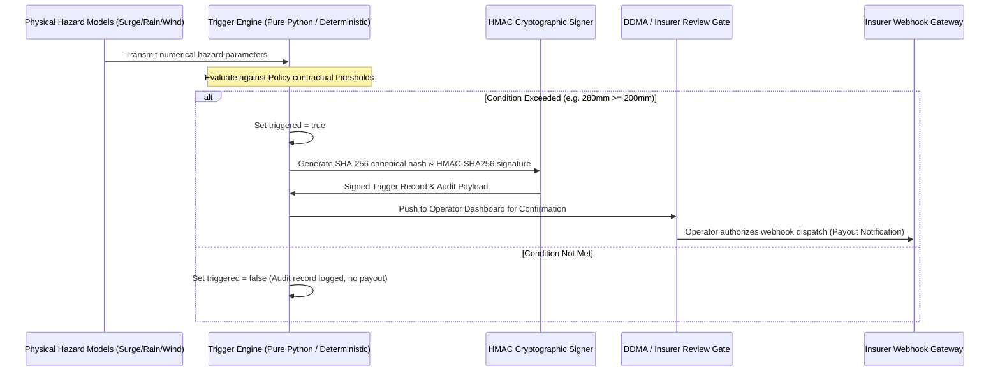

# Parametric Insurance Trigger Specification

Parametric insurance bypasses traditional loss-adjustment claim lifecycles (which take 4–12 weeks) by releasing emergency liquidity **pre-landfall** or immediately at impact when pre-agreed objective physical indices are met.

---

## 1. Trigger Types & Physical Indices

| Trigger Identifier | Primary Sensor / Model Source | Unit | Operational Threshold Example |
|---|---|---|---|
| `surge_height` | Bathymetry-calibrated parametric surge model / GEE DEM | meters (m) | `surge_height >= 2.0` |
| `rainfall_total` | GFS/ECMWF 48-hour cumulative rainfall forecast | millimeters (mm) | `rainfall_mm_48h >= 200.0` |
| `wind_speed` | IMD/JTWC 1-minute sustained wind at landfall | km/h (or knots) | `wind_speed_kmh >= 150.0` |

---

## 2. Deterministic Trigger Contract Execution



---

## 3. Cryptographic Audit Trail & HMAC Authentication

Every trigger payload is deterministically serialized into canonical JSON and signed:

```json
{
  "trigger_id": "TRIG-7a4f91e2",
  "policy_id": "POL-PURI-MUNI-01",
  "zone_id": "ZONE-PURI-COASTAL",
  "event_id": "CYCLONE-FANI-2019",
  "trigger_type": "rainfall_total",
  "threshold_value": 200.0,
  "observed_value": 280.0,
  "triggered": true,
  "payout_amount_usd": 250000.0,
  "trigger_timestamp": "2026-09-28T01:50:00Z",
  "audit_hash": "e3b0c44298fc1c149afbf4c8996fb92427ae41e4649b934ca495991b7852b855",
  "signature_hmac": "9b71d224bd62f3785d96d46ad3ea3d73319bfbc2890caadae2dff72519673ca7",
  "disclaimer": "NOTIFICATION AND AUDIT ARTIFACT ONLY — Parametric liquidity release notification. Requires authorized human confirmation before execution."
}
```

- **Canonical Hash**: SHA-256 of strictly ordered fields `(policy_id, zone_id, event_id, trigger_type, threshold, observed)`.
- **HMAC Signature**: Keyed SHA-256 hash using the insurer-broker shared secret (`PAYOUT_SIGNING_KEY`).
