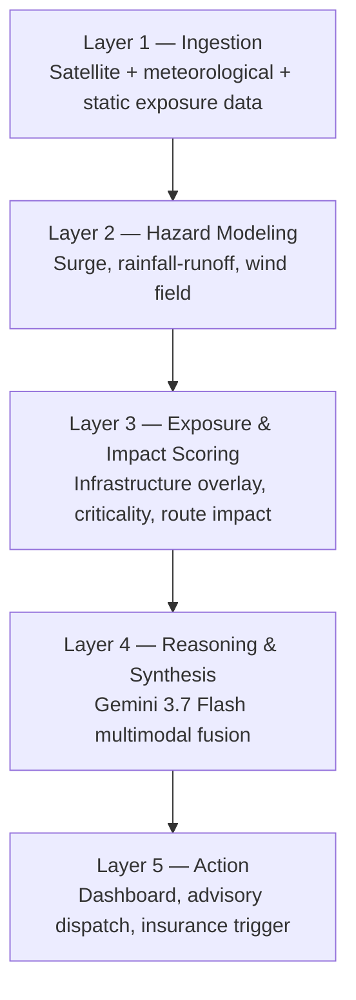
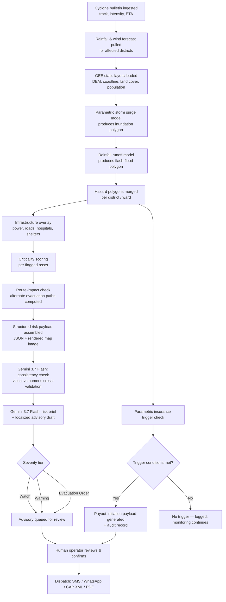

# Anticipatory Action Platform for Bay of Bengal & Coastal APAC Cyclones
### AI-Powered Predictive Risk, Vulnerability Modeling & Parametric Insurance Trigger Platform
### Full Implementation Plan

---

## 1. Executive Summary

Coastal communities around the Bay of Bengal and wider coastal APAC (India's east coast, Bangladesh, Myanmar, Sri Lanka, parts of Southeast Asia) face recurring cyclone landfalls where disaster response is largely **reactive** — search-and-rescue and relief after damage has already occurred, and insurance payouts that arrive months after a loss when they are least useful.

This platform shifts the response curve **left**, into the 24–120 hour pre-landfall window, by fusing four capabilities into a single decision pipeline:

1. **Storm surge simulation** — where the water will go
2. **Rainfall damage pathway prediction** — where flash floods and waterlogging will happen, independent of surge
3. **Critical infrastructure exposure mapping** — what gets hit (power grids, arterial roads, hospitals, shelters)
4. **Automated early-warning dispatch** — getting the right advisory to the right authority in time to act, plus a **parametric insurance liquidity trigger** so payouts can move *before* landfall rather than months after

The system is built on three technical pillars:

- **Google Earth Engine (GEE)** for satellite-derived terrain, land cover, coastal geometry, and historical flood calibration data
- **Real-time meteorological data** for cyclone track, intensity, and rainfall forecasts
- **Gemini 3.7 Flash multimodal reasoning** as the fusion layer that turns raw geospatial and numeric model output into a cross-checked, human-readable, jurisdiction-ready advisory — and a machine-readable trigger payload for parametric insurance contracts

The result is a single pipeline that, given a live or historical cyclone, can produce: a live risk map, a per-ward risk brief, a dispatch-ready advisory in the correct institutional format, and an auditable insurance-trigger record — end to end, in minutes rather than days.

---

## 2. Problem Statement & Scope

### 2.1 Core problem
Disaster management authorities (DDMAs), utilities, and insurers in the Bay of Bengal region currently rely on:
- Coarse, national-level cyclone bulletins that are not localized to ward/village level
- Manual, slow translation of meteorological bulletins into local evacuation orders
- Loss-adjuster-based insurance claims that take weeks to months to pay out, long after the liquidity was actually needed (immediately post-landfall)

### 2.2 In-scope for this build
- Bay of Bengal basin cyclones (India east coast, Bangladesh, Myanmar coast, Sri Lanka)
- Storm surge, rainfall-flood, and wind exposure — not earthquake, tsunami, or landslide
- District/ward-level granularity (the level at which DDMAs actually operate)
- A parametric insurance **trigger engine** (computing whether contractual trigger conditions are met and preparing the payout-initiation payload) — not the underwriting or claims-settlement process itself

### 2.3 Explicitly out of scope (state this clearly to judges)
- Fully certified, operational-grade hydrodynamic modeling (ADCIRC/SLOSH-equivalent accuracy) — the hackathon build uses a calibrated parametric proxy, with a clear upgrade path
- Real dispatch to real emergency numbers — all messaging demoed on sandbox/test channels
- Actual claims settlement or underwriting logic — only the trigger-detection and payout-initiation signal

---

## 3. Goals & Success Metrics

| Goal | Metric used in demo |
|---|---|
| Faster localization of risk | Time from "cyclone bulletin ingested" to "ward-level risk map generated" |
| Actionable, not just informative, output | Advisory includes named shelters, named roads, specific population counts — not just "heavy rain expected" |
| Trustworthy AI reasoning | Every number in a Gemini-generated advisory is traceable back to a specific upstream data field (no hallucinated figures) |
| Closing the financial protection gap | Insurance trigger payload generated automatically the moment modeled loss conditions are met, with full audit trail |
| Human accountability preserved | No advisory or insurance trigger is dispatched without an explicit human confirmation step in the loop |

---

## 4. System Architecture

### 4.1 Layered overview

The system is organized into five layers, each with a single responsibility, so any layer can be swapped out later (e.g., replacing the parametric surge model with ADCIRC) without touching the others.



### 4.2 Detailed pipeline (single clean top-down flow)

This is the same system drawn one level deeper, kept intentionally as one straight top-to-bottom flow with no crossing lines, so it is easy to narrate live during a demo.



### 4.3 Why this shape
- Every arrow moves in one direction only (ingestion → modeling → reasoning → action); nothing loops back except through the human-review gate, which is intentional and load-bearing for responsible deployment.
- The insurance trigger branches directly off the merged hazard layer (F), not off the AI-generated text, so a financial payout is never dependent on an LLM's phrasing — only on the underlying structured hazard data. Gemini only drafts the human-readable notification of the trigger.

---

## 5. Data Sources

### 5.1 Google Earth Engine collections

| Purpose | GEE Dataset | Notes |
|---|---|---|
| Elevation / coastal slope | `USGS/SRTMGL1_003`, `MERIT/DEM/v1_0_3` | Used for surge bathtub-fill and TWI |
| Coastline & surface water | `JRC/GSW1_4/GlobalSurfaceWater` | Coastal boundary + connectivity masking |
| Land cover / surface roughness | `ESA/WorldCover/v200` | Drives surge friction and rainfall permeability |
| Historical flood extent (calibration) | `GLOBAL_FLOOD_DB/MODIS_EVENTS/V1` | Used to backtest the surge/rainfall models against real past events |
| Population density | `WorldPop/GP/100m/pop`, `CIESIN/GPWv411` | Evacuation sizing per ward |
| Building footprints | `GOOGLE/Research/open-buildings/v3/polygons` | Shelter/infrastructure proxy where official data is missing |
| Nighttime lights | `NOAA/VIIRS/DNB/MONTHLY_V1/VCMSLCFG` | Proxy for active grid load / recovery tracking post-event |

### 5.2 Real-time meteorological & hazard feeds

| Country/Agency | Feed | Use |
|---|---|---|
| India — IMD (RSMC New Delhi) | Cyclone bulletins | Authoritative Bay of Bengal cyclone track/intensity source |
| Bangladesh — BMD | Bulletins | Regional cross-check |
| Myanmar — DMH | Bulletins | Regional cross-check |
| Sri Lanka — DMC | Bulletins | Regional cross-check |
| JTWC (US Navy/Air Force) | Track/intensity | Backup international source |
| GDACS | Aggregated alert feed | Fast machine-readable cross-agency alert ingestion |
| ECMWF Open Data | Numerical weather | Rainfall/wind field forecast |
| NOAA GFS (via NOMADS or Open-Meteo) | Numerical weather | Rainfall/wind field forecast, easier REST access for hackathon speed |

### 5.3 Static exposure layers

| Layer | Source | Notes |
|---|---|---|
| Roads (arterial/trunk) | OpenStreetMap via Overpass API | Tag filter `highway=primary/trunk/secondary` |
| Power lines & substations | OpenStreetMap | Tag filter `power=line/substation` |
| Hospitals & clinics | OpenStreetMap | Tag filter `amenity=hospital/clinic` |
| Cyclone shelters | Curated CSV per demo district | Falls back to community/school buildings from OSM where no official list exists |

### 5.4 Parametric insurance reference inputs
- Historical cyclone catalog (IBTrACS — International Best Track Archive for Climate Stewardship) for trigger-threshold calibration
- Modeled loss proxy from Section 6.3 (exposure × criticality) used as the parametric index, since real claims data is not available in a hackathon setting

---

## 6. Modeling Layer — Detailed Design

### 6.1 Storm Surge Simulator (parametric proxy)

Full hydrodynamic modeling (ADCIRC, SLOSH) is not buildable in a hackathon window. The build instead uses a **calibrated parametric proxy**, framed explicitly to judges as a *screening-speed model*, not a certified forecast:

1. **Surge height estimate** — regression against central pressure deficit, radius of maximum winds, and forward speed, calibrated against real historical Bay of Bengal cyclones (Amphan 2020, Fani 2019, Yaas 2021, Mocha 2023) pulled from IBTrACS + post-event surge survey reports
2. **Shelf amplification factor** — derived from GEE bathymetry/elevation slope near the predicted landfall point; shallow, funnel-shaped coasts (Odisha coast, Bangladesh delta, Rakhine coast) amplify the base surge estimate
3. **Bathtub-fill with connectivity constraint** — the estimated surge height is applied as a fill over the coastal DEM within a buffered landfall radius, using flow-connectivity (flood-fill) to the open sea so that isolated, unconnected low-lying pixels are not falsely flagged
4. **Output** — a GeoJSON inundation polygon with a surge-height attribute per zone

### 6.2 Rainfall-Runoff / Flash-Flood Pathway Model

1. Pull rainfall forecast grid (mm over next 24/48/72h)
2. Compute Topographic Wetness Index (TWI) from the GEE DEM (`ee.Terrain.slope`, flow accumulation approximation)
3. Combine into a runoff risk score:
   `runoff_risk = f(rainfall_intensity, TWI, land_cover_permeability)`
4. Threshold into Low / Medium / High / Severe classes, vectorized into per-cell polygons, merged with the surge polygon into one hazard layer per ward

### 6.3 Exposure & Criticality Scoring Engine

For every infrastructure asset from Section 5.3:

```
exposure_score    = spatial_overlap(asset_geometry, hazard_polygon)
criticality_score = weighted(asset_type, population_served, redundancy)
priority_score    = exposure_score × criticality_score
```

- Hospitals/shelters inside a hazard polygon → flagged **CRITICAL — relocate or resupply**
- Roads inside a hazard polygon → flagged **evacuation route may be cut**; `route_impact.py` recomputes shortest path from population centroid to nearest unflagged shelter using `osmnx`/`networkx` with flagged edges removed
- Power lines/substations inside a high-wind or surge zone → flagged **preemptive shutdown candidate**, to reduce post-landfall electrocution/fire risk

### 6.4 Parametric Insurance Liquidity Trigger Engine (core module, not a stretch goal)

This directly answers the "parametric insurance liquidity" requirement in the brief.

**Concept:** instead of waiting for a loss-adjuster to visit a site after landfall, define trigger conditions **before landfall**, tied to modeled physical parameters, and fire the trigger automatically the moment those parameters are forecast/observed to be met.

**Trigger schema (per insured zone):**
```json
{
  "policy_id": "string",
  "zone_id": "string",
  "trigger_type": "surge_height | rainfall_total | wind_speed | composite_loss_index",
  "threshold": "number",
  "observed_or_forecast_value": "number",
  "confidence": "forecast | observed",
  "triggered": "boolean",
  "trigger_timestamp": "ISO8601",
  "source_model_version": "string"
}
```

**Flow:**
1. Trigger engine subscribes to the same merged hazard layer used by the exposure scoring module (Section 4.2, node F)
2. For each insured zone, compares modeled surge height / rainfall total / composite loss index against the policy's pre-agreed threshold
3. If met, generates a signed, timestamped trigger record (the payout-initiation payload) — this is a **notification and audit artifact**, not an actual funds transfer, since real payment rails are out of scope for a hackathon
4. Gemini drafts a plain-language trigger notification for the insurer/reinsurer and the covered community, but the trigger boolean itself is computed purely from structured data — never from LLM output — so the financial decision is deterministic and auditable

This closes the loop the challenge brief describes: pre-landfall evacuation planning **and** pre-landfall financial liquidity, from the same hazard model.

---

## 7. Gemini 3.7 Flash Multimodal Reasoning Layer

Gemini is used as a **fusion and translation layer**, not a chatbot bolt-on. It sits between structured model output and every human-facing or institution-facing document the system produces.

### 7.1 Inputs given to Gemini per ward/zone
- A rendered map (satellite base + hazard overlay + flagged infrastructure), generated server-side and passed as an image
- A structured JSON payload: surge height, rainfall totals, flagged assets with scores, population count, cyclone category and ETA, insurance trigger status
- District/administrative and language context, for localization

### 7.2 Gemini tasks

**Task A — Visual/numeric consistency check**
Cross-checks whether the modeled hazard polygon is geomorphologically plausible against the visible image (e.g., flags a polygon that crosses a visible ridge line, or that floods an area the imagery shows as elevated high ground). This is a sanity-check pass that exploits multimodal reasoning specifically — a text-only model cannot do this.

**Task B — Risk narrative generation**
Converts numeric scores into a structured, ward-level brief, e.g.:
> "Ward 7 (population ~12,000): surge height 2.4m expected, coinciding with the only paved access road to Community Shelter #3. Recommend evacuation start at T-36h."

**Task C — Advisory drafting**
Produces a dispatch-ready advisory following the applicable national advisory template (e.g., NDMA/IMD format for India), in English plus the relevant regional language, at one of three severity tiers: **Watch / Warning / Evacuation Order**.

**Task D — Insurance trigger notification drafting**
Converts a fired trigger record (Section 6.4) into a plain-language notice for insurers and covered communities, explaining what threshold was crossed and what happens next.

**Task E — Operator Q&A / explainability**
Answers follow-up questions from a human operator ("why is this shelter flagged?") by reasoning over the same structured context already assembled — this is what makes the system feel like an analyst rather than a black box, and is what builds operator trust fast enough to actually be used under time pressure.

### 7.3 Prompt design principle (stated explicitly to judges)
Every prompt is constrained to **forbid inventing any number not present in the supplied JSON**, and every generated document carries a machine-checkable footer mapping each figure back to its source field. A lightweight post-generation validator (`ai-reasoning/validate_output.py`) re-parses the generated text and checks any numeric mentions against the source payload before the document is allowed into the human-review queue.

### 7.4 Example prompt skeletons

**Consistency check:**
```
SYSTEM: You are a disaster-risk analyst assistant. You are given a map image
showing a modeled flood/surge extent over a district, and structured JSON
describing that same extent numerically. Check whether the shape of the
polygon is plausible given the visible terrain in the image. Flag any
specific area where the modeled hazard does not match visible topography.
Do not invent data not present in the JSON.

USER: [map image] + {hazard JSON for Ward 7}
```

**Advisory drafting:**
```
SYSTEM: You are drafting an official disaster advisory for a District
Disaster Management Authority, following the [national advisory template].
Use only the values present in the supplied JSON. State the severity tier,
affected wards, named critical assets at risk, and the recommended
evacuation window. Produce the advisory in English and in [regional
language]. Do not add any figure not present in the input.

USER: {ward risk payload, JSON} + severity_tier: "Warning"
```

**Insurance trigger notice:**
```
SYSTEM: You are drafting a parametric insurance trigger notification.
Explain, in plain language, which threshold was crossed, the modeled
value that crossed it, and that a payout-initiation process has begun.
Do not state or imply a payout amount or timeline not present in the
input payload.

USER: {trigger record JSON from Section 6.4}
```

---

## 8. Early-Warning & Insurance Dispatch Automation

| Channel | Use case | Implementation |
|---|---|---|
| SMS | Field-level alerts to DDMA officers / shelter managers | Twilio API, sandbox numbers for demo |
| WhatsApp | Structured advisory with map snippet | WhatsApp Business Cloud API, test number |
| CAP (Common Alerting Protocol) XML | Interop with official warning systems (e.g., India's Sachet platform) | Valid CAP 1.2 XML generated and exported — demonstrates standards compliance even without live federation |
| Email / PDF | Formal institutional record | Auto-generated PDF advisory (`weasyprint`/`reportlab`) |
| Insurer webhook | Parametric trigger notification | Signed JSON POST to a mock insurer endpoint, simulating a real payout-initiation call |

**Escalation logic:** advisory tier (Watch → Warning → Evacuation Order) escalates automatically as time-to-landfall shortens and/or criticality scores rise, but **no dispatch — advisory or insurance trigger notification — leaves the system without an explicit human confirmation click.** This is a deliberate design choice, not a limitation: full autonomy over evacuation orders or fund releases is not appropriate even in a production system, and stating this clearly is itself a strength in front of judges.

---

## 9. Database Schema (PostgreSQL + PostGIS)

```sql
CREATE TABLE districts (
    district_id     TEXT PRIMARY KEY,
    country         TEXT NOT NULL,
    name            TEXT NOT NULL,
    geom            GEOMETRY(MultiPolygon, 4326)
);

CREATE TABLE wards (
    ward_id         TEXT PRIMARY KEY,
    district_id     TEXT REFERENCES districts(district_id),
    name            TEXT NOT NULL,
    population      INTEGER,
    geom            GEOMETRY(MultiPolygon, 4326)
);

CREATE TABLE cyclone_events (
    event_id        TEXT PRIMARY KEY,
    name            TEXT,
    source          TEXT,               -- IMD, JTWC, GDACS, etc.
    category        TEXT,
    eta             TIMESTAMPTZ,
    track_geom      GEOMETRY(LineString, 4326),
    ingested_at     TIMESTAMPTZ DEFAULT now()
);

CREATE TABLE hazard_polygons (
    hazard_id       TEXT PRIMARY KEY,
    event_id        TEXT REFERENCES cyclone_events(event_id),
    ward_id         TEXT REFERENCES wards(ward_id),
    hazard_type     TEXT,               -- surge | rainfall_flood
    severity_class  TEXT,
    attribute_value NUMERIC,            -- surge height (m) or rainfall (mm)
    geom            GEOMETRY(MultiPolygon, 4326),
    model_version   TEXT,
    created_at      TIMESTAMPTZ DEFAULT now()
);

CREATE TABLE infrastructure_assets (
    asset_id        TEXT PRIMARY KEY,
    ward_id         TEXT REFERENCES wards(ward_id),
    asset_type      TEXT,               -- hospital | shelter | road | power_line | substation
    name            TEXT,
    criticality     NUMERIC,
    geom            GEOMETRY(Geometry, 4326)
);

CREATE TABLE exposure_scores (
    score_id        TEXT PRIMARY KEY,
    event_id        TEXT REFERENCES cyclone_events(event_id),
    asset_id        TEXT REFERENCES infrastructure_assets(asset_id),
    exposure_score  NUMERIC,
    priority_score  NUMERIC,
    computed_at     TIMESTAMPTZ DEFAULT now()
);

CREATE TABLE advisories (
    advisory_id     TEXT PRIMARY KEY,
    event_id        TEXT REFERENCES cyclone_events(event_id),
    ward_id         TEXT REFERENCES wards(ward_id),
    severity_tier   TEXT,               -- Watch | Warning | Evacuation Order
    content_en      TEXT,
    content_local   TEXT,
    generated_by    TEXT DEFAULT 'gemini-3.7-flash',
    reviewed_by     TEXT,
    dispatched_at   TIMESTAMPTZ
);

CREATE TABLE insurance_triggers (
    trigger_id      TEXT PRIMARY KEY,
    policy_id       TEXT,
    zone_id         TEXT,
    event_id        TEXT REFERENCES cyclone_events(event_id),
    trigger_type    TEXT,
    threshold_value NUMERIC,
    observed_value  NUMERIC,
    triggered       BOOLEAN,
    trigger_timestamp TIMESTAMPTZ,
    audit_hash      TEXT
);

CREATE TABLE dispatch_log (
    dispatch_id     TEXT PRIMARY KEY,
    advisory_id     TEXT REFERENCES advisories(advisory_id),
    channel         TEXT,               -- sms | whatsapp | cap_xml | pdf | insurer_webhook
    recipient       TEXT,
    status          TEXT,
    dispatched_at   TIMESTAMPTZ DEFAULT now()
);
```

---

## 10. API Contract (FastAPI backend)

| Method | Endpoint | Purpose |
|---|---|---|
| `POST` | `/ingest/cyclone-event` | Register a new cyclone bulletin (track, intensity, ETA) |
| `GET` | `/risk/{district_id}` | Return merged hazard polygons + exposure scores for a district |
| `GET` | `/risk/{district_id}/wards/{ward_id}` | Ward-level detail: hazard values, flagged assets, route impact |
| `POST` | `/advisory/generate` | Trigger Gemini advisory generation for a given ward + event |
| `POST` | `/advisory/{advisory_id}/review` | Human operator approves/edits a draft advisory |
| `POST` | `/advisory/{advisory_id}/dispatch` | Send an approved advisory via selected channel(s) |
| `GET` | `/insurance/triggers/{event_id}` | List insurance trigger evaluations for an event |
| `POST` | `/insurance/triggers/{trigger_id}/notify` | Dispatch a trigger notification to insurer webhook |
| `GET` | `/assets/{district_id}` | List infrastructure assets and current criticality scores |

**Example — `GET /risk/{district_id}` response (abridged):**
```json
{
  "district_id": "IN-OD-PURI",
  "event_id": "CYCLONE-FANI-2019",
  "wards": [
    {
      "ward_id": "WARD-07",
      "population": 12000,
      "surge_height_m": 2.4,
      "rainfall_mm_48h": 180,
      "severity_tier": "Warning",
      "flagged_assets": [
        {"asset_id": "SHELTER-03", "type": "shelter", "priority_score": 0.91},
        {"asset_id": "ROAD-12", "type": "road", "priority_score": 0.77}
      ]
    }
  ]
}
```

---

## 11. Tech Stack

| Layer | Choice | Rationale |
|---|---|---|
| Geospatial processing | `earthengine-api`, `geemap`, `geopandas`, `shapely`, `rasterio` | Direct satellite access, no bulk download needed; standard geospatial toolchain |
| Backend | Python, FastAPI | Fast to build, async-native, strong geospatial library support |
| AI reasoning | Gemini 3.7 Flash via Google AI Studio / Vertex AI SDK | Multimodal, low latency, cost-efficient for high-frequency re-runs as forecasts update |
| Routing/network analysis | `osmnx`, `networkx` | Road exposure and alternate-route computation |
| Database | PostgreSQL + PostGIS (Supabase for fast hackathon setup) | Standard geospatial store, generous free tier |
| Frontend | React + MapLibre GL / deck.gl | Interactive layered map dashboard, no vendor lock-in |
| Messaging | Twilio (SMS), WhatsApp Business Cloud API | Sandbox mode works without account approval, fast integration |
| Auth | Auth0 or Supabase Auth | Fast to wire up, role-based access for DDMA operators vs. insurer viewers |
| Hosting | Vercel (frontend) + Cloud Run (backend) | Free tiers, fast deploy for demo day |
| Orchestration | Cloud Scheduler / simple cron | Periodic re-run as cyclone forecasts update |
| Observability | Sentry (errors) + a simple structured-logging dashboard | Needed once the trigger engine handles anything insurance-adjacent |
| Testing | `pytest`, `pytest-cov`, historical backtest notebooks | Both unit correctness and model validity against real past cyclones |

---

## 12. Project Structure

```
cyclone-anticipatory-platform/
├── README.md
├── .env.example
├── docker-compose.yml
├── infra/
│   ├── terraform/
│   │   ├── cloud_run.tf
│   │   ├── postgis_instance.tf
│   │   └── scheduler.tf
│   └── github-actions/
│       ├── ci.yml
│       └── deploy.yml
│
├── data-ingestion/
│   ├── gee/
│   │   ├── auth.py                    # GEE service account auth
│   │   ├── terrain.py                 # DEM, slope, TWI extraction
│   │   ├── landcover.py               # land cover + permeability classes
│   │   ├── historical_floods.py       # historical flood extent pulls (calibration)
│   │   └── exports.py                 # export GEE layers as GeoTIFF/GeoJSON
│   ├── weather/
│   │   ├── cyclone_track.py           # IMD/BMD/DMH/DMC/JTWC/GDACS fetch & parse
│   │   ├── rainfall_forecast.py       # Open-Meteo / GFS / ECMWF rainfall grid fetch
│   │   └── schemas.py                 # pydantic models for weather payloads
│   └── exposure/
│       ├── osm_extract.py             # roads, hospitals, power lines via Overpass
│       └── shelters.py                # curated/known shelter dataset loader
│
├── modeling/
│   ├── surge/
│   │   ├── parametric_surge.py        # empirical surge height + bathtub fill
│   │   └── calibration/               # IBTrACS-based historical calibration notebooks
│   ├── rainfall_runoff/
│   │   └── flash_flood_model.py       # TWI-based runoff risk scoring
│   ├── exposure_scoring/
│   │   ├── asset_overlay.py           # spatial join assets <-> hazard polygons
│   │   ├── criticality.py             # weighting logic per asset type
│   │   └── route_impact.py            # osmnx shortest-path w/ flagged edges removed
│   └── insurance_trigger/
│       ├── trigger_engine.py          # threshold comparison + audit record generation
│       ├── policy_schemas.py          # policy_id, zone_id, trigger_type, threshold
│       └── payout_payload.py          # builds signed payout-initiation payload
│
├── ai-reasoning/
│   ├── gemini_client.py               # Vertex AI / AI Studio SDK wrapper
│   ├── prompts/
│   │   ├── consistency_check.md
│   │   ├── risk_brief.md
│   │   ├── advisory_draft.md
│   │   └── insurance_trigger_notice.md
│   ├── map_render.py                  # render map image for multimodal input
│   ├── advisory_generator.py          # orchestrates: risk data -> Gemini -> advisory object
│   └── validate_output.py             # post-generation numeric consistency validator
│
├── dispatch/
│   ├── cap_alert.py                   # build CAP 1.2 XML
│   ├── sms_dispatch.py                # Twilio integration
│   ├── whatsapp_dispatch.py           # WhatsApp Cloud API integration
│   ├── pdf_report.py                  # formal advisory PDF generation
│   ├── insurer_webhook.py             # payout-initiation webhook call
│   └── dispatch_orchestrator.py       # tier logic + human-in-the-loop gate
│
├── backend/
│   ├── main.py                        # FastAPI app entrypoint
│   ├── routers/
│   │   ├── ingest.py
│   │   ├── risk.py
│   │   ├── advisory.py
│   │   ├── insurance.py
│   │   └── assets.py
│   ├── db/
│   │   ├── models.py                  # SQLAlchemy + PostGIS models
│   │   ├── migrations/
│   │   └── session.py
│   ├── auth/
│   │   └── rbac.py                    # DDMA operator vs. insurer viewer roles
│   └── config.py
│
├── frontend/
│   ├── src/
│   │   ├── components/
│   │   │   ├── MapView.tsx            # MapLibre/deck.gl layered map
│   │   │   ├── RiskPanel.tsx          # per-ward risk cards
│   │   │   ├── AdvisoryPreview.tsx    # Gemini-generated advisory preview + edit
│   │   │   ├── DispatchControls.tsx   # human-in-the-loop send button
│   │   │   └── InsuranceTriggerPanel.tsx  # trigger status + notify control
│   │   ├── pages/
│   │   │   ├── Dashboard.tsx
│   │   │   └── AdminPanel.tsx
│   │   └── api/client.ts
│   └── package.json
│
├── tests/
│   ├── unit/
│   │   ├── test_surge_model.py
│   │   ├── test_runoff_model.py
│   │   ├── test_exposure_scoring.py
│   │   └── test_trigger_engine.py
│   ├── integration/
│   │   └── test_end_to_end_pipeline.py
│   └── prompt_eval/
│       └── test_advisory_numeric_consistency.py
│
├── notebooks/
│   ├── 01_gee_exploration.ipynb
│   ├── 02_surge_calibration.ipynb
│   ├── 03_insurance_trigger_backtest.ipynb
│   └── 04_demo_district_walkthrough.ipynb
│
└── docs/
    ├── architecture.md
    ├── data_sources.md
    ├── advisory_template_ndma.md
    ├── insurance_trigger_spec.md
    └── demo_script.md
```

---

## 13. Non-Functional Requirements

| Category | Target (hackathon demo) | Target (production direction) |
|---|---|---|
| Latency, ingestion → risk map | < 60 seconds for a single district | < 5 minutes nationwide |
| Latency, risk map → advisory draft | < 15 seconds per ward | < 30 seconds per ward |
| Availability | Best-effort for demo | 99.9%, multi-region |
| Data retention | Session-only / demo database | Full audit trail, especially for insurance triggers |
| Localization | English + 1 regional language | All Bay of Bengal regional languages |

---

## 14. Security, Privacy & Responsible AI Considerations

- **No autonomous dispatch:** every advisory and every insurance trigger notification requires an explicit human confirmation click before leaving the system (see Section 8) — this is a hard architectural constraint, not a configurable setting.
- **Deterministic financial logic:** the insurance trigger boolean (Section 6.4) is computed from structured hazard data only; Gemini never determines whether a trigger fires, only how it is explained.
- **Numeric grounding:** all Gemini-generated documents pass through a post-generation validator (`validate_output.py`) that checks every number against the source JSON before the document can enter the human-review queue.
- **PII minimization:** population figures are used in aggregate (ward-level counts), never individual-level data.
- **Role-based access:** DDMA operators, insurer viewers, and admin roles are separated via RBAC; insurer-facing views never expose raw citizen contact data used for SMS/WhatsApp dispatch.
- **Auditability:** every dispatched advisory and every fired insurance trigger is logged with a timestamp, source model version, and reviewing operator ID (`dispatch_log`, `insurance_triggers` tables).

---

## 15. Testing & Validation Strategy

| Test type | What it checks |
|---|---|
| Unit tests (`tests/unit/`) | Surge model, runoff model, exposure scoring, and trigger engine each produce correct output for known synthetic inputs |
| Integration test (`tests/integration/`) | Full pipeline run, ingestion → dispatch, against a historical cyclone, checked for no unhandled exceptions and sane output ranges |
| Historical backtesting (`notebooks/02`, `notebooks/03`) | Surge/runoff model output compared against real historical flood extent (GEE `GLOBAL_FLOOD_DB`) and real insurance-relevant thresholds for Amphan, Fani, Yaas, Mocha |
| Prompt evaluation (`tests/prompt_eval/`) | Every Gemini-generated advisory is checked programmatically for numeric figures not present in the source payload — a failing test here blocks the advisory from the review queue |

---

## 16. Demo Scenario Design

Replay a **real, well-documented historical cyclone** so the demo is falsifiable and credible, rather than a synthetic toy example.

**Recommended: Cyclone Fani (2019, Odisha, India)** — India's real evacuation of roughly 1.2 million people is a strong "here is what we could have done faster and more precisely" narrative, and IMD documentation is relatively accessible for calibration.

**Secondary scenario for multi-country credibility: Cyclone Mocha (2023, Myanmar/Bangladesh, Rakhine coast)** — demonstrates the platform is not India-only, and highlights the humanitarian stakes in a lower-resource-data environment.

**Demo flow:**
1. Load the historical track at T-72h before actual landfall
2. Generate the live ward-level hazard overlay for the real affected district
3. Show flagged real infrastructure (a real hospital/shelter/road from OSM)
4. Show the Gemini-generated risk brief and the drafted, localized advisory
5. Show the parametric insurance trigger firing, with the drafted notification
6. Show simulated dispatch (Twilio SMS to a demo phone, generated CAP XML, mock insurer webhook call)
7. Close with a single measured number: "This ran in under X seconds from bulletin ingestion to a dispatch-ready advisory and a fired insurance trigger."

---

## 17. Build Plan

### 17.1 Hackathon build (36–48 hour window)

| Phase | Hours | Tasks |
|---|---|---|
| Setup | 0–4 | Repo scaffold, GEE service account, API keys (Gemini, Twilio, weather), pick demo district + cyclone |
| Data pipeline | 4–12 | GEE DEM/land cover export; OSM asset extraction; historical cyclone track loaded |
| Core hazard models | 12–22 | Parametric surge model + bathtub fill; rainfall-runoff scoring; exposure/criticality scoring |
| Insurance trigger engine | 20–26 | Threshold schema, trigger comparison logic, audit record generation |
| AI reasoning layer | 22–30 | Gemini integration: consistency check, risk brief, advisory draft, trigger notice; prompt iteration |
| Dispatch + backend API | 26–34 | FastAPI endpoints; Twilio/CAP XML/PDF generation; insurer webhook mock |
| Frontend dashboard | 22–36 | Map view with layered overlays; risk panel; advisory + trigger review/edit UI |
| Integration + demo polish | 34–44 | End-to-end run on chosen historical cyclone; fix edge cases; rehearse demo |
| Buffer / pitch prep | 44–48 | Slides, README, backup recording of the full demo run |

### 17.2 Post-hackathon roadmap (first 90 days, for the pitch's closing slide)

| Phase | Focus |
|---|---|
| Weeks 1–3 | Replace parametric surge model with a coupled shallow-water solver (e.g., GeoClaw) for higher-fidelity inundation extent |
| Weeks 3–6 | Formal integration with a national alert system (e.g., India's Sachet platform) and real insurer sandbox API |
| Weeks 6–10 | Multi-country expansion: Bangladesh and Myanmar exposure datasets, regional language advisory templates |
| Weeks 10–13 | Post-event feedback loop: validate modeled hazard extent and fired triggers against real damage/claims reports, recalibrate thresholds |

---

## 18. Team Roles

| Role | Focus |
|---|---|
| Geospatial/GEE engineer | Sections 5, 6.1–6.3 (`data-ingestion/gee`, `modeling/surge`, `modeling/rainfall_runoff`) |
| Backend engineer | FastAPI, PostGIS schema, dispatch orchestration, RBAC |
| AI/prompt engineer | Gemini integration, prompt design, output validator, advisory template fidelity |
| Insurance/actuarial-minded teammate | Trigger schema design, threshold calibration, insurer-facing notification content |
| Frontend engineer | Dashboard, map layering, advisory/trigger review UX |
| Domain/pitch lead | Historical cyclone research, demo narrative, judging Q&A prep |

---

## 19. Cost & Infrastructure Estimate (hackathon + first 90 days)

| Item | Hackathon cost | Early-production monthly estimate |
|---|---|---|
| Google Earth Engine | Free (research/nonprofit tier) | Free tier likely sufficient at pilot scale |
| Gemini 3.7 Flash API | Free/low-cost hackathon credits | Usage-based, low per-call cost at Flash tier |
| Twilio (SMS sandbox) | Free sandbox | Pay-per-message once out of sandbox |
| WhatsApp Business API | Free test tier | Pay-per-conversation at scale |
| Supabase (Postgres + Auth) | Free tier | Low fixed monthly cost at pilot scale |
| Hosting (Vercel + Cloud Run) | Free tier | Low fixed monthly cost at pilot scale |

---

## 20. Judging-Criteria Alignment

| Criterion | How this plan addresses it |
|---|---|
| Technical depth | Real GEE pipelines, genuine (if intentionally simplified) physical modeling, a deterministic insurance-trigger engine — not a UI mockup |
| Novel use of AI | Gemini as a multimodal fusion and cross-validation layer, drafting real institutional and financial documents — not a wrapper chatbot |
| Real-world impact | Anchored to real historical cyclones with real population and infrastructure at stake; closes both the evacuation-planning and financial-liquidity gaps named in the brief |
| Feasibility/completeness | Full pipeline demoable live: ingestion → modeling → reasoning → dispatch → insurance trigger |
| Responsible deployment | Explicit human-in-the-loop gate on every dispatch and every trigger; deterministic (non-LLM) financial logic |
| Scalability | Modular, swappable layers; same architecture extends to Bangladesh, Myanmar, Sri Lanka without redesign |

---

## 21. Key Risks & Mitigations

| Risk | Mitigation |
|---|---|
| GEE quota/auth issues mid-hackathon | Pre-export needed layers to local GeoTIFF/GeoJSON early as a fallback cache |
| Live meteorological APIs rate-limited or down during demo | Historical cyclone replay is the primary demo path; live feed is a bonus toggle |
| Surge model accused of being "not scientific enough" | State upfront it is a calibrated screening-speed proxy, with a named roadmap to ADCIRC/GeoClaw-grade modeling |
| Gemini hallucinating numbers in advisories or trigger notices | Prompts explicitly forbid inventing data; post-generation numeric validator blocks ungrounded output before human review |
| Insurance trigger logic perceived as a "black box" | Trigger boolean is computed from structured, inspectable data only, with a full audit record — deliberately never delegated to the LLM |
| Dispatch demo looking like it could send real false alarms or real payouts | Always demo on sandbox numbers and a mock insurer endpoint, with a visible human-confirmation click |

---

## 22. Glossary

| Term | Meaning |
|---|---|
| DDMA | District Disaster Management Authority |
| GEE | Google Earth Engine |
| DEM | Digital Elevation Model |
| TWI | Topographic Wetness Index |
| CAP | Common Alerting Protocol (international alert message standard) |
| IBTrACS | International Best Track Archive for Climate Stewardship (historical cyclone track database) |
| Parametric insurance | Insurance that pays out automatically when a predefined, measurable trigger condition is met, rather than after a manual loss assessment |
| RBAC | Role-Based Access Control |

---

## 23. Appendix — Sample Outputs

**Sample generated advisory (English, Warning tier):**
> WARNING — Ward 7, Puri District. Cyclone [name] expected surge height 2.4m within 36 hours. Community Shelter #3 access road (Road-12) is at risk of being cut off. Residents in the surge zone are advised to relocate to Community Shelter #3 before the access road is affected. Estimated population in the affected zone: 12,000.

**Sample insurance trigger notice:**
> TRIGGER NOTICE — Policy [policy_id], Zone [zone_id]. Modeled surge height of 2.6m has crossed the contractual trigger threshold of 2.0m as of [timestamp]. Payout-initiation process has begun under source model version [version]. This notice is generated from structured hazard data and is subject to policy terms.

**Sample CAP alert (structure only):**
```xml
<alert xmlns="urn:oasis:names:tc:emergency:cap:1.2">
  <identifier>CYCLONE-FANI-2019-WARD07-001</identifier>
  <sender>anticipatory-action-platform@example.org</sender>
  <status>Actual</status>
  <msgType>Alert</msgType>
  <scope>Public</scope>
  <info>
    <event>Cyclone Storm Surge Warning</event>
    <urgency>Expected</urgency>
    <severity>Severe</severity>
    <certainty>Likely</certainty>
    <area>
      <areaDesc>Ward 7, Puri District</areaDesc>
    </area>
  </info>
</alert>
```
